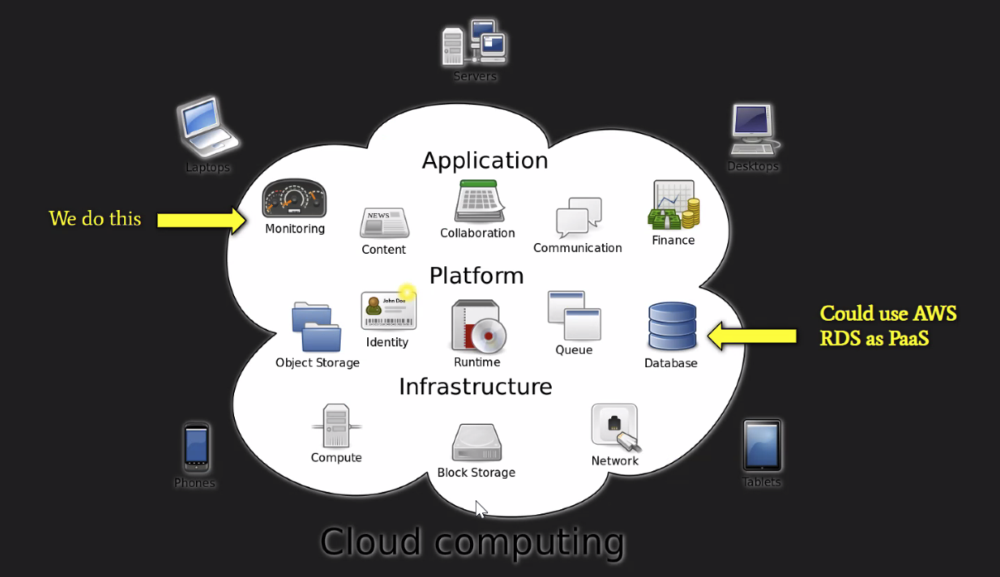
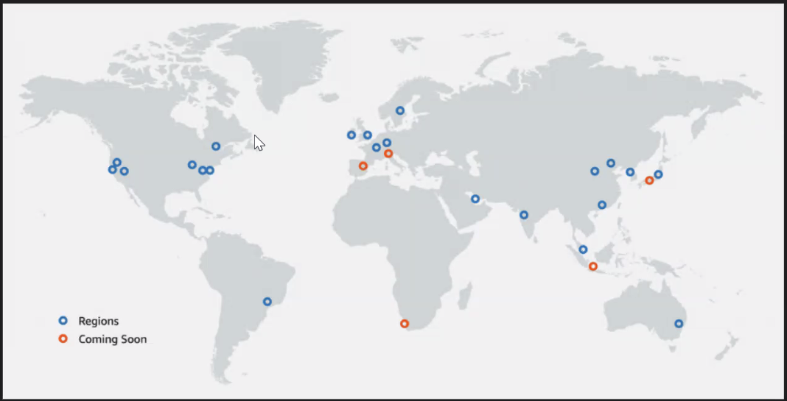
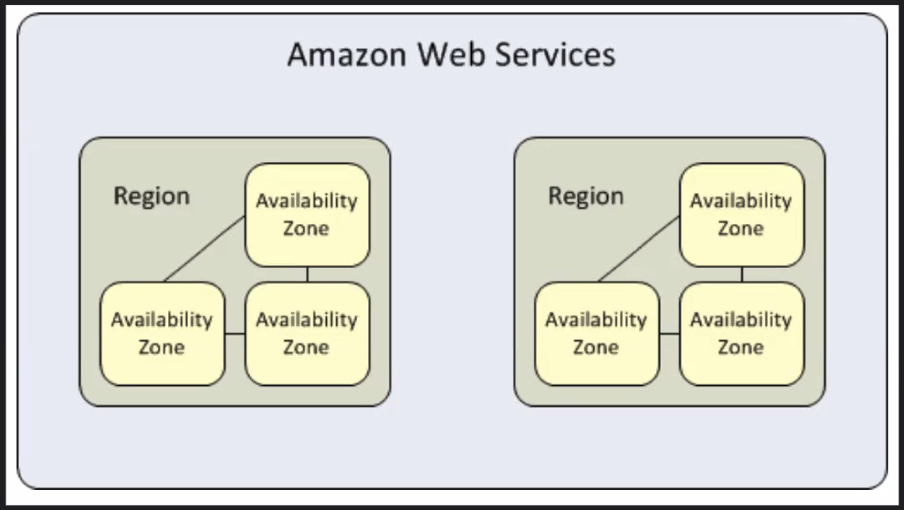

# April 26, 2021 Lecture Notes
> Break for 1:1 & Instructor Revature Meeting (1.5hr)
> QC 2:00 PM EST

## Basics of Cloud Computing & AWS



### What is cloud computing?
Cloud computing refers to the delivery of on demand computing services over the internet on.a pay-as-you-go basis
> example
> Remote server, database, infrastructure to take away the bulk of my computing in my application.

### What is the Cloud?
The cloud refers to any remote server hosted by a external source over the internet.

### What is AWS?
* Acronym "Amazon Web Services" (AWS)
* Comes with a multitude of services like EC2, RDS, S3

**RDS**
* Used to setup, operate, and scale relational databases in the cloud using simple steps

### Cloud Computing Types
**Public**

* Cloud computing that is delivered via the internet and shared across organizations/the general public

* Advantages:
	* Technical agility (highly scalable and flexible) to meet unpredictable workloads.
	* Affordable

* Disadvantage:
	* Lack of security
	* cost control - total cost of ownership can rise exponentially for large-scale usage, which is bad for larger enterprises.

**Private**

* Cloud computing that is dedicated solely to your organization

* Advantages
	* Custom security - more secure than public.
	* Provides exclusive environment for organization
	* Flexible - can change the infrastructure based on IT/company's needs

* Disadvantages
	*  Price
	*  Scalability is limited to on-premise computing resources

**Hybrid**

* Uses both public & private clouds
* Advantages
	* Scale with security
	* Reliable (distribute our services across different data centers)
	* Cost Control - improve security on sensitive workloads to our private clouds while regular workloads can be spread across our public clouds; therefore we don't tradeoff our infrastructure for the sake of cost investments

> [Public vs Private vs Hybrid: Cloud Differences Explained](https://www.bmc.com/blogs/public-private-hybrid-cloud/)

**Infrastructure as a Service (IaaS)** is on-demand access to cloud-hosted physical and virtual servers, storage and networking - the backend IT infrastructure for running applications and workloads in the cloud.

**Platform as a Service (PaaS)** is on-demand access to a complete, ready-to-use, cloud-hosted platform for developing, running, maintaining and managing applications.

**Software as a Service (SaaS)** is on-demand access to ready-to-use, cloud-hosted application software.

[What are Iaas, Paas and Saas?](https://www.ibm.com/cloud/learn/iaas-paas-saas)

Amazon Relational Database Service (Amazon RDS) is a web service that makes it easier to set up, operate, and scale a relational database in the AWS Cloud.


### Regions
a highly available data center that houses Amazon Cloud Computing Resources in different areas of the world (25 in total)



### Availability Zones
Each AWS Region contains multipl distinct locations called Availability Zones, or AZs.
Each Zone is engineered to be isolated from failures in other Availability Zones. (90 total inthe world)

**Fault-tolerence** defines the ability for a system to remain in operation even if some of the compinents used to build the system fail.



## AWS RDS Setup Demo

### Database Creation

**Search RDS**
**Click RDS**
**Click Create DB**

**DB Create Method**

* Standard Create
* Version (PostgresSql 14.1)

**Template**

* Free Tier

**Settings**

* DB cluster identifier
	* "Your-Own-Name"  

* Master username
	*  "Your-Own-Password"

**Connectivity**

* Settings
	* Yes

* Security Group
	* ers-security-group (or your custom security group)

**Click Create DB**

### Security Group Creation

**Search EC2**

**Click Secuity Groups (On the left under Networking)**

* Create Security Groups
* Give name and description
* Add Rule
	* Type:
		* All Traffic
		* Custom
	* Source:
		* Anywhere
		* (personal IP address)

## Connect RDS DB to DBeaver

## SQL Basics
### What is SQL?
Stands for Structured Query Language
This is used to create and manage relational database sing human-readable language

### What is a database?
A collection of related data

**DBMS (Database Management System)** is a collection of programs used to create and maintain a database.

### Why use a database?
* Store our data in a structured format
* Allows us concurrent use of data to many users
* Control access to the data through usage of admin privelages
* Maintain data intgrity aka maintain the consistency and accuaracy of our data
* Provides good data backup and recovery

**RDBMS (Relational Database Management System)** refers to a database that stores data in a structured format consisting of table, rows and columns

**Table** - Collective group of data
**Column** data categories
**Rows** - particular instances of a data category
**Schema** - layout of our database (similar to how classes are blueprints of our Java objects)

### Demo Schema:

**referential integrity** - Establishing relationships between tables through use of PLs and FKs
**primary key** - unique, non-null identifier for a table

* Departments
	* id (**primary key**)
	* name
	* monthly budget
* Employees
	* id (**primary key**)
	* first_name
	* last_name
	* birthdate
	* monthly_income
	* department_id (foreign key, **primary key** from another table)
	* hire_date
	* job_title
	* email
* Products
	* id (PK)
	* name
	* price
	* expiration_date

### SQL can be broken down into 5 sublanguages:
1. **DDL** - Data Definition Language.
	* Used to manage the structure of database schema
	* Commands: CREATE, DROP, TRUNCATE, ALTER, RENAME
2. **DML** - Data Manipulation Language.
	* Used to manipulate the data in our DB
	* Commands: INSERT, UPDATE, DELETE (CRUD)
	
	> C.R.U.D. - Create Read Update Delete
	
3. **DQL** - Data Query Language
	* Used to retrieve information from our database
	* Commands: SELECT
4. **DCL** - Data Control Language
	* Used to give privilages/access of our data
	* Commands: GRANT, REVOKE
5. **TCL** - Transaction Control Language
	* Apply the changes of out data permanently into our DB
	* Commands: COMMIT, ROLLBACK, SAVEPOINT

```
-- common to see a series of DROP table statments at the beginning of any table creation script

DROP table if exists products;
DROP table if exists employees;
DROP table if exists departments;

CREATE TABLE departments(
-- serial is an auto incremented numeric data type in SQL
-- varchar is for string values
-- numeric is for decimal
	id serial constraint department_pk primary key, --inline constraint declaration
	name varchar(25) unique not null, -- canidate key (a column that could be a pk, but is not)
	monthly_budget numeric(8, 2) 
	-- first number is precision (# of digits allowed)
	-- second number is scale (# of decimal places)
);

CREATE TABLE employees(
	id serial,
	first_name varchar(25) NOT NULL,
	last_name varchar(25) NOT NULL,
	birthdate date NOT NULL,
	monthly_income numeric(7,2),
	department_id int,
	hire_date date DEFAULT current_date,
	job_title varchar(25) NOT NULL,
	email varchar(320) NOT NULL,
	
	-- Another was to declaring constrinats (restrictions to a columns's behavior)
	constraint employees_pk 
	primary key(id),
	
	-- foreign key constraint
	constraint employee_department_fk
	foreign key (department_id)
	references departments
	
	-- by default, FKs automatically point to the PK of the referenced table
	-- FK can point to non-PK columns in a reference table so long as the referenced columnis UNIQUE
);

CREATE TABLE products(
	id serial,
	name varchar(50) NOT NULL,
	price numeric(7, 2) DEFAULT 0,
	expiration_date date NOT NULL
);

ALTER TABLE products
ADD constraint products_pk primary key (id);

-- no need to COMMIT the above statments, DDL statements are implicitly committed

/* INSERT STATEMENTS */
-- SQL strings are single quoted
INSERT INTO departments VALUES (1, 'Accounting', 20000);
INSERT INTO departments (name, monthly_budget) VALUES ('Marketing', 15000);
INSERT INTO departments (name, monthly_budget)
VALUES
('IT', 30000),
('Human resources', 25000),
('Customer Service', 3200),
('Internal Affaris', 5000);

INSERT INTO employees (first_name, last_name, birthdate, monthly_income, department_id, hire_date, job_title, email) VALUES ('John', 'Smith', date '1995-01-01', 4000.00, 1, date '2015-03-28', 'AC_ACCOUNT', 'jsmith@company.com');

INSERT INTO products (name, price, expiration_date)
VALUES 
	('Aspirin', 5.00, date '2022-12-31'),
	('Penicillin', 10.00, date '2019-04-30'),
	('Insulin', 25.50, date '2023-05-31'),
	('BadMedX', 6.00, date '1874-09-17'),
	('GoodMed3000', 1300.25, date '2025-12-31');


/* SELECT STATEMENTS */
-- Query the records within th table
-- * is the wildcard for all columns within a given table
SELECT * FROM departments;

-- TO NARROW DOWN MY INFO SEARCH TO PARTICULAR ID NUMBERS
-- To narrow down the info search to particular numbers
-- WHERE is used ot filter information based on a condition
SELECT * FROM departments WHERE id = 4;
SELECT name, monthly_budget FROM departments WHERE id = 3;

SELECT * FROM employees e; -- The e is a "table alias" (alternative name)
SELECT * FROM employees e where e.department_id = 1;
SELECT * FROM products p;

-- DML statements must be explicity committed
-- Even though DBeaver auto-commits for you, don't rely on this.
COMMIT;

DELETE FROM products; -- a delete statement without a where clause will delete all records from the table

ROLLBACK; -- Takes you back to the previous SAVEPOINT or COMMIT
-- Rolling back to a savepoint and then rolling back again will take you to the previous COMMIT
-- You cannot rollback beyond the most recent commit
-- Making a SAVEPOINT when one already exists will overwrite the previous SAVEPOINT (only one SAVEPOINT may exist at a time). 

```

***ER Diagram for above***


### Multiplicity

> Will be reviewed tomorrow


