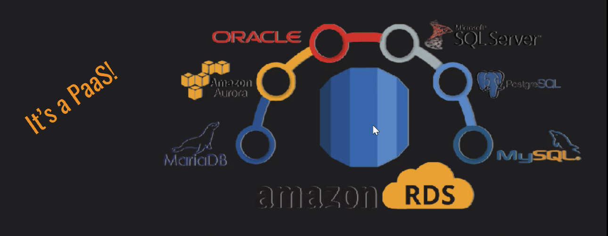
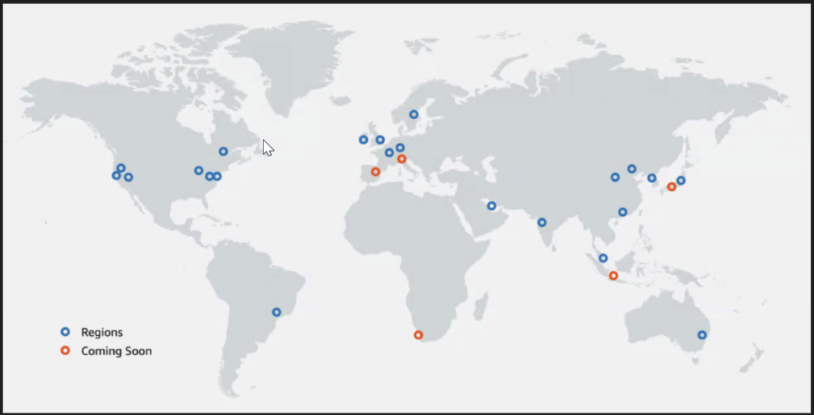
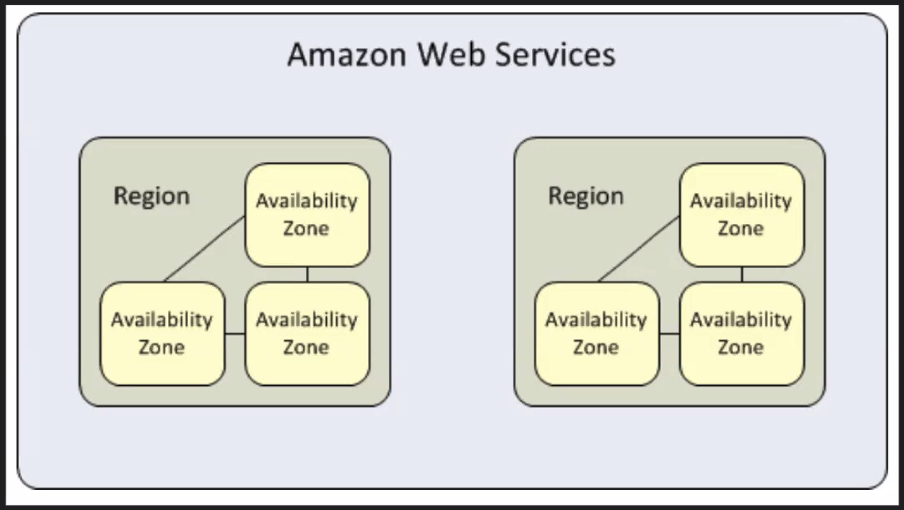

# April 26, 2021 Lecture Notes
> Break for 1:! & Instructor Revature Meeting (1.5hr)
> QC 2:00 PM EST

## Basics of Cloud Computing & AWS

### What is cloud computing?
Cloud computing refers to the delivery of on demand computing services over the internet on.a pay-as-you-go basis
> example
> Remote server, database, infrastructure to take away the bulk of my computing in my application.

### What is the Cloud?
The cloud refers to any remote server hosted by a external source over the internet.

### What is AWS?
* Acronym "Amazon Web Services" (AWS)
* Comes with a multitude of services like EC2, RDS, S3

**RDS**
* Used to setup, operate, and scale relational databases in the cloud using simple steps

### Cloud Computing Types
**Public**

* Cloud computing that is delivered via the internet and shared across organizations/the general public

* Advantages:
	* Technical agility (highly scalable and flexible) to meet unpredictable workloads.
	* Affordable

* Disadvantage:
	* Lack of security
	* cost control - total cost of ownership can rise exponentially for large-scale usage, which is bad for larger enterprises.

**Private**

* Cloud computing that is dedicated solely to your organization

* Advantages
	* Custom security - more secure than public.
	* Provides exclusive environment for organization
	* Flexible - can change the infrastructure based on IT/company's needs

* Disadvantages
	*  Price
	*  Scalability is limited to on-premise computing resources

**Hybrid**

* Uses both public & private clouds
* Advantages
	* Scale with security
	* Reliable (distribute our services across different data centers)
	* Cost Control - improve security on sensitive workloads to our private clouds while regular workloads can be spread across our public clouds; therefore we don't tradeoff our infrastructure for the sake of cost investments

> [Public vs Private vs Hybrid: Cloud Differences Explained](https://www.bmc.com/blogs/public-private-hybrid-cloud/)

**Infrastructure as a Service (IaaS)** is on-demand access to cloud-hosted physical and virtual servers, storage and networking - the backend IT infrastructure for running applications and workloads in the cloud.

**Platform as a Service (PaaS)** is on-demand access to a complete, ready-to-use, cloud-hosted platform for developing, running, maintaining and managing applications.

**Software as a Service (SaaS)** is on-demand access to ready-to-use, cloud-hosted application software.

[What are Iaas, Paas and Saas?](https://www.ibm.com/cloud/learn/iaas-paas-saas)

Amazon Relational Database Service (Amazon RDS) is a web service that makes it easier to set up, operate, and scale a relational database in the AWS Cloud.

### Regions
a highly available data center that houses Amazon Cloud Computing Resources in different areas of the world (25 in total)

### Availability Zones
Each AWS Region contains multipl distinct locations called Availability Zones, or AZs.
Each Zone is engineered to be isolated from failures in other Availability Zones. (90 total inthe world)

**Fault-tolerence** defines the ability for a system to remain in operation even if some of the compinents used to build the system fail.

## AWS RDS Setup Demo

### Database Creation

**Search RDS**
**Click RDS**
**Click Create DB**

**DB Create Method**

* Standard Create
* Version (PostgresSql 14.1)

**Template**

* Free Tier

**Settings**

* DB cluster identifier
	* "Your-Own-Name"  

* Master username
	*  "Your-Own-Password"

**Connectivity**

* Settings
	* Yes

* Security Group
	* ers-security-group (or your custom security group)

**Click Create DB**

### Security Group Creation

**Search EC2**

**Click Secuity Groups (On the left under networking)**

* Create Security Groups
* Give name and description
* Add Rule
	* Type: 
		* All Traffic
		* Custom
	* Source:
		* Anywhere
		* (personal IP address)

## Connect RDS DB to DBeaver

## SQL Basics

### Multiplicity

