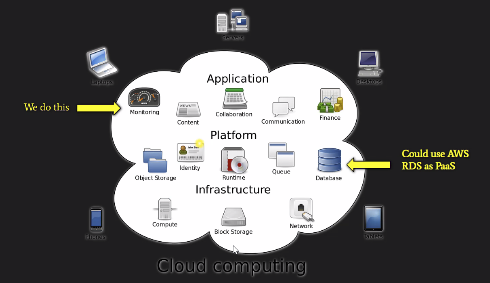

# April 26, 2021 Lecture Notes
> Break for 1:! & Instructor Revature Meeting (1.5hr)
> QC 2:00 PM EST

## Basics of Cloud Computing & AWS

### What is cloud computing?
Cloud computing refers to the delivery of on demand computing services over the internet on.a pay-as-you-go basis
> example
> Remote server, database, infrastructure to take away the bulk of my computing in my application.

### What is the Cloud?
The cloud refers to any remote server hosted by a external source over the internet.

### What is AWS?
* Acronym "Amazon Web Services" (AWS)
* Comes with a multitude of services like EC2, RDS, S3

**RDS**
* Used to setup, operate, and scale relational databases in the cloud using simple steps

### Cloud Computing Types
**Public**

* Cloud computing that is delivered via the internet and shared across organizations/the general public

* Advantages:
	* Technical agility (highly scalable and flexible) to meet unpredictable workloads.
	* Affordable

* Disadvantage:
	* Lack of security
	* cost control - total cost of ownership can rise exponentially for large-scale usage, which is bad for larger enterprises.

**Private**

* Cloud computing that is dedicated solely to your organization

* Advantages
	* Custom security - more secure than public.
	* Provides exclusive environment for organization
	* Flexible - can change the infrastructure based on IT/company's needs

* Disadvantages
	*  Price
	*  Scalability is limited to on-premise computing resources

**Hybrid**

* Uses both public & private clouds
* Advantages
	* Scale with security
	* Reliable (distribute our services across different data centers)
	* Cost Control - improve security on sensitive workloads to our private clouds while regular workloads can be spread across our public clouds; therefore we don't tradeoff our infrastructure for the sake of cost investments

> [Public vs Private vs Hybrid: Cloud Differences Explained](https://www.bmc.com/blogs/public-private-hybrid-cloud/)

## AWS RDS Setup Demo

## Connect RDS DB to DBeaver

## SQL Basics

### Multiplicity

