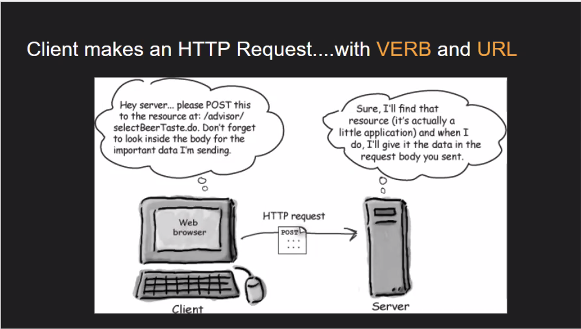
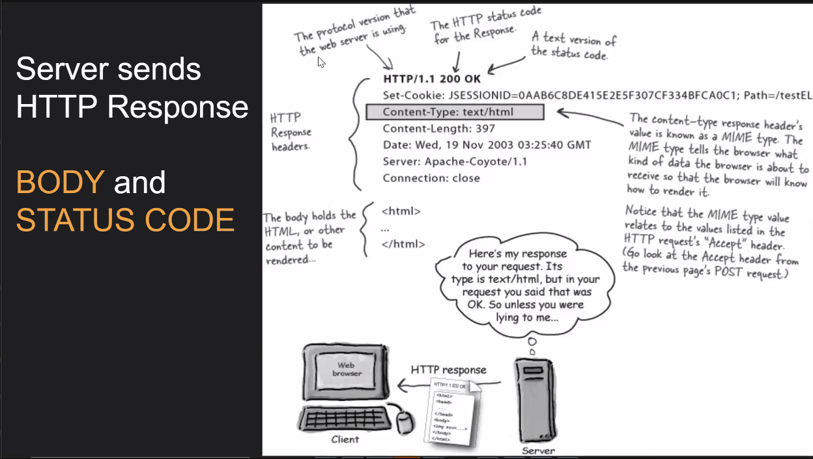
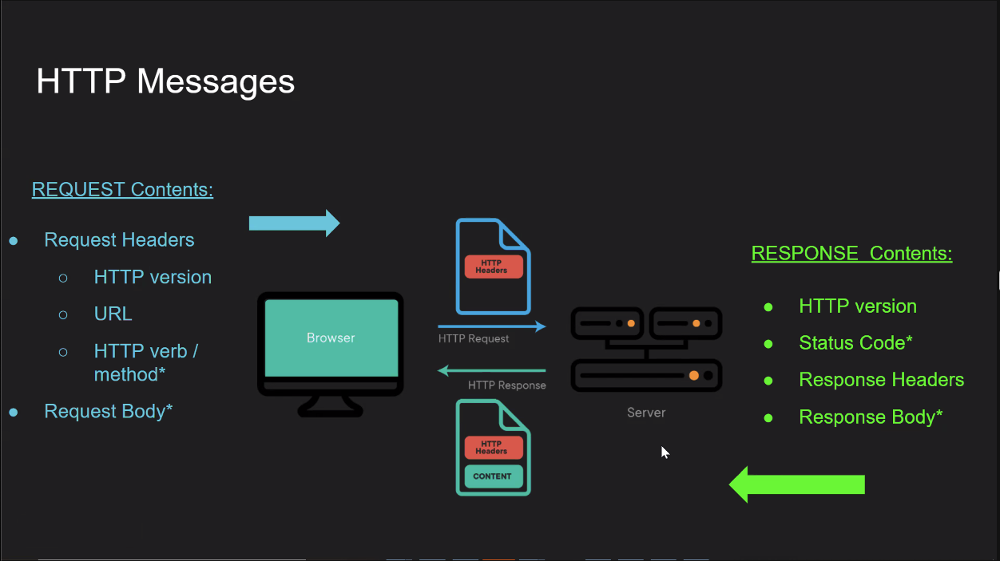
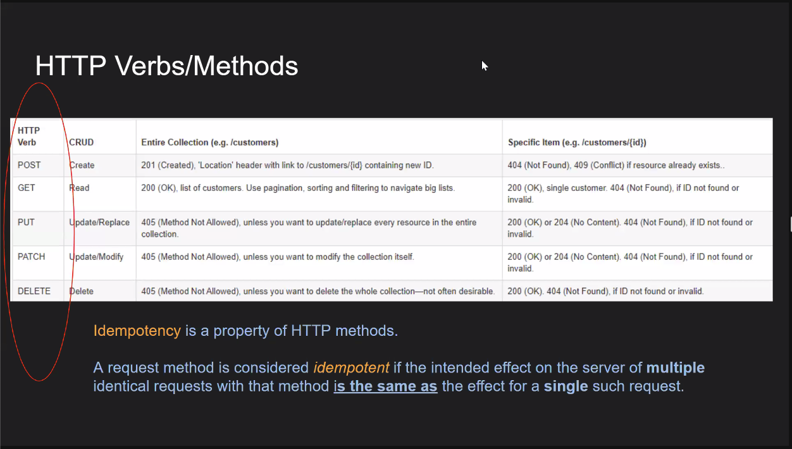
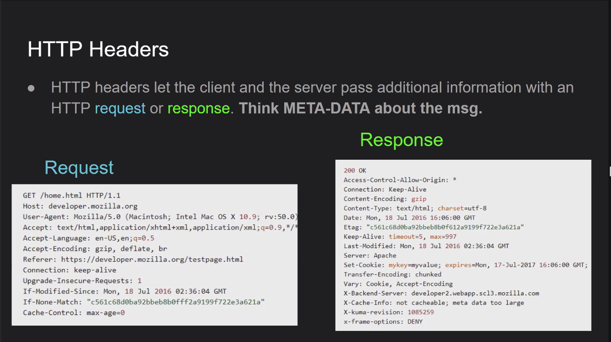
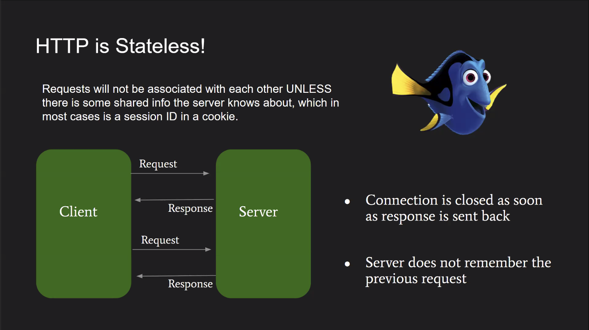
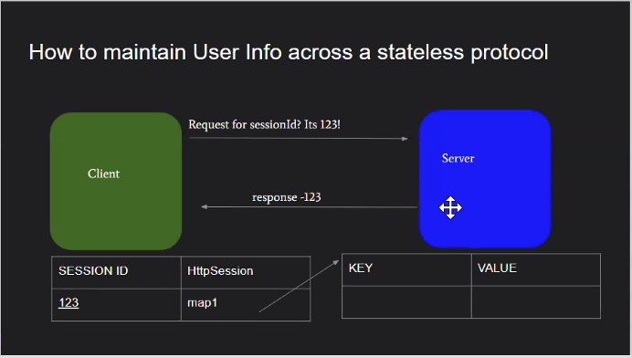

# May 9, 2022
## Intro Into Web Services

## HTTP
*Protocol which allows the requesting and fetching of resources between a client and server.*

**Protocol** a system of rules that define how data is exhanged within or between computers.

> ftp,smtp - other transfer protocols to know



> Based on the above
> 
**Verb** - POST
**URL** - http://lcoalhost:8080/advisors
**body** - Can be written in text of JSON format (Java Sscript Object Notation)
	
> JSON Example:

```
{
	id: 1,
	name: "George",
	password: "frog",
}
```
**Headers** - Meta data information that can be included inside an HTTP Request

* Authentication
* Cache Control
* CORS
* etc



**Response Codes** 
1. Informational responses (100–199)
2. Successful responses (200–299)
3. Redirection messages (300–399)
4. Client error responses (400–499)
5. Server error responses (500–599)












## Servlets
*A Java class that is used to extend the capabilities of a Server that hosts application accessed by means of a host request response programming model*

Received information from HTTP request and passes to the application. Also sends the response from the application back to the client


## Javalin
