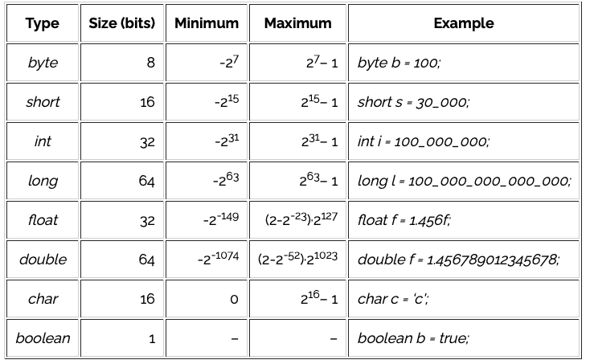

# Java Questions

> Note: Don't forget about this document. [Revature Study Guide](https://sites.google.com/revature.com/studyguide/java?authuser=0). The references in this document are from the internet through google searches. These provide additional references to the material below.

## What is Java?
Java is the #1 programming language and development platform. Java is a programming language and computing platform which has evolved from humble beginnings to power a large share of today’s digital world, by providing the reliable platform upon which many services and applications are built.

Java is a high-level programming language that is multi-threading, secure, strongly- typed and derived from C.
“write once, run anywhere” ( WORA) – means that compiled java code can run on all platforms that support Java without the need for recompilation.

[Oracle.com](https://www.oracle.com/java/)
[Java.com](https://www.java.com/en/download/help/whatis_java.html)

## What are some of the features/benefits of Java and what do they mean?

- Multithreading – is a technique that allows for concurrent execution of two or more parts of a program for maximum utilization of a CPU.
- Platform independent
- Object Oriented
- Simple (easy to learn)
- Secure
- Strongly Typed
- Automatic memory management

## What is JRE / JDK / JVM?

### JRE
The Java Runtime Environment, or JRE, is a software layer that runs on top of a computer’s operating system software and provides the class libraries and other resources that a specific Java program needs to run.

### JDK
The Java Development Kit, or JDK, is a set of tools for developing Java applications. Developers choose JDKs by Java version and by package or edition—Java Enterprise Edition (Java EE), Java Special Edition (Java SE), or Java Mobile Edition (Java ME). Every JDK always includes a compatible JRE, because running a Java program is part of the process of developing a Java program.

### JVM
The Java Virtual Machine, or JVM, executes live Java applications. Every JRE includes a default JRE, but developers are free to choose another that meets the specific resource needs of their applications.

*Java compiler turns the code into bytecode and JVM interprets byte code into machine code which runs on different platforms such as windows, Linux, MacOS.*

[IBM](https://www.ibm.com/cloud/learn/jre)

## What is the difference between an object and a class?

### Class
The building block that leads to Object-Oriented Programming. It is a user-defined data type, that holds its own data members and member functions, which can be accessed and used by creating an instance of that class. It is the blueprint of any object.

### Object
an instance of a class. All data members and member functions of the class can be accessed with the help of objects. When a class is defined, no memory is allocated but when it is instantiated (i.e. an object is created), memory is allocated.

[Geeks for Geeks](https://www.geeksforgeeks.org/difference-between-class-and-object/)

## What is the root class from which every class extends? 
Java.lang.Object class is the root or superclass of the class hierarchy, which is present in java.lang package. All predefined classes and user-defined classes are the subclasses from Object class.

[Tutorialspoint.com](https://www.tutorialspoint.com/why-object-class-is-the-super-class-for-all-classes-in-java)

## What are the primitive data types in Java?



### boolean
* true, false - either 0, or 1

Declare a boolean:

```
boolean b = true;

boolean b;
```

### byte
* similar to int, but takes up 8 bits of memory
* values between -128 & 127 (inclusive)

Declare a byte:

```
byte b = 100;

byte empty;
```

### int (integer)
* int type holds a wide range of non-fractional number values
* Java stores it using 32 bits of memory

Declare a int:

```
int x = 424_242;

int y;
```

### short
* also similar to int, but larger than byte.
* 16 bits of memory
* range of -32.768 to 32.767 (inclusive)

Declare a short:

```
short s = 20_020;

short s;
```

### long
* related to int, but it is larger
* It's stored in 64 bits of memory
* range -9,223,372,036,854,775,808 to 9,223,372,036,854,775,807 (inclusive)

Declare a long:

```
long l = 1_234_567_890;

long l;
```

### double
* It's stored in 64 bits of memory. 
* Range is 4.9406564584124654 to 1.7976931348623157 (positive and negative - inclusive)

Declare a double:

```
double d = 3.13457599923384753929348D;

double d;
```

### float
* This type is stored in 32 bits of memory just like int.
* Range is 1.40239846 x 10-45, and the largest value is 3.40282347 x 1038 (positive and negative - inclusive).

Declare a float:

```
float f = 3.145f;

float f;
```

### char (character)
* 16-bit integer representing a Unicode-encoded character.
* Range is from 0 to 65,535. In Unicode, this represents ‘\u0000' to ‘\uffff'

Declare a char:

```
char c = 'a';

char c = 65;

char c;
```

[Baeldung](https://www.baeldung.com/java-primitives)

## Explain stack vs heap

To run an application in an optimal way, JVM divides memory into stack and heap memory. Whenever we declare new variables and objects, call a new method, declare a String, or perform similar operations, JVM designates memory to these operations from either Stack Memory or Heap Space.

### Stack
Stack Memory in Java is used for static memory allocation and the execution of a thread. It contains primitive values that are specific to a method and references to objects referred from the method that are in a heap.

Access to this memory is in Last-In-First-Out (LIFO) order. Whenever we call a new method, a new block is created on top of the stack which contains values specific to that method, like primitive variables and references to objects.

Some other features of stack memory include:

* It grows and shrinks as new methods are called and returned, respectively.
* Variables inside the stack exist only as long as the method that created them is running.
* It's automatically allocated and deallocated when the method finishes execution.
* If this memory is full, Java throws java.lang.StackOverFlowError.
* Access to this memory is fast when compared to heap memory.
* This memory is threadsafe, as each thread operates in its own stack.

### Heap
Heap space is used for the dynamic memory allocation of Java objects and JRE classes at runtime.

New objects are always created in heap space, and the references to these objects are stored in stack memory.

These objects have global access and we can access them from anywhere in the application.

1. **Young Generation** – this is where all new objects are allocated and aged. A minor Garbage collection occurs when this fills up.
2. **Old or Tenured Generation** – this is where long surviving objects are stored. When objects are stored in the Young Generation, a threshold for the object's age is set, and when that threshold is reached, the object is moved to the old generation.
3. **Permanent Generation** – this consists of JVM metadata for the runtime classes and application methods.

[Baeldung](https://www.baeldung.com/java-stack-heap)

## Where are Strings stored in memory?
In Java, strings are stored in the heap area.

> Why Java strings stored in Heap, not in Stack? 
> String is a class and strings in java treated as an object, hence the object of String class will be stored in Heap, not in the stack area.

[Geeks for Geeks: Storage of String in Java](https://www.geeksforgeeks.org/storage-of-string-in-java/)

## Are variable references stored on the stack or heap? What about the objects they refer to?

### Stack
Variable references are stored in the stack

### Heap
The objects to which they refer are stored in the heap.

## What is a stack trace? What kind of information do they tell you?

### Stack Trace
A stack trace is a list of the method calls that the application was in the middle of when an Exception was thrown.

> The stack trace can assist in finding where a bug is present in an application.

## What are annotations?

## What is a POJO?


## Explain the POJO Design Pattern. 

## What is garbage colleciton?

## Can you force garbage collection in Java? When is an object eligible for GC? 

## Why are strings immutable in java? How would you make your own objects immutable?

## What is the difference between String, StringBuilder, and StringBuffer? 

## What are the different variable scopes in Java? 

## What are the access modifiers in Java? Explain them. 

## What are the non##access modifiers in Java? 

## What is the difference between static and final variables? 

## What are the default values for all data types in Java? 

## What is a wrapper class? List them. 

## What is autoboxing / unboxing? 

## Is Java pass-by-value or pass-by-reference? 

## How can you make a class immutable? 

## If two objects are equal, do they have the same hashcode? If not equal? 

## What is a conditional statement? What are the different types?

## What data types are supported in switch statements? 

## What is a method?

## What is the difference between a package and an import in Java?

## Can an import be static? Give an example of one. 

## What methods are available in the Object class? 

## What is the difference between == and .equals()? 

## What is an enhanced for loop? 

## What does the “super” keyword do? 

## What is the first line of any constructor? 

## What happens if you don’t define a constructor for a class? Can you still instantiate it? 

## What is a literal value in Java?

## What are operators? List some operators.

## What is the compliation process that our Java code goes through?

## What is the difference between final, .finalize(), and finally? 

## What is an exception? What makes it different from an error?

## Explain the difference between throw, throws, and Throwable 

## Do you need a try block? 

## Do you need a catch block? Can# Java Questions

## What is Java? What are some of the features/benefits of Java and what do they mean?

## What is JRE / JDK / JVM? 

## What is the difference between an object and a class? 

## What is the root class from which every class extends? 

## What are the primitive data types in Java? 

## Explain stack vs heap

## Where are Strings stored in memory? 

## Are variable references stored on the stack or heap? What about the objects they refer to? 

## What is a stack trace? What kind of information do they tell you? 

## What are annotations? 

## What is a POJO?

## Explain the POJO Design Pattern. 

## What is garbage colleciton?

## Can you force garbage collection in Java? When is an object eligible for GC? 

## Why are strings immutable in java? How would you make your own objects immutable?

## What is the difference between String, StringBuilder, and StringBuffer? 

## What are the different variable scopes in Java? 

## What are the access modifiers in Java? Explain them. 

## What are the non##access modifiers in Java? 

## What is the difference between static and final variables? 

## What are the default values for all data types in Java? 

## What is a wrapper class? List them. 

## What is autoboxing / unboxing? 

## Is Java pass-by-value or pass-by-reference? 

## How can you make a class immutable? 

## If two objects are equal, do they have the same hashcode? If not equal? 

## What is a conditional statement? What are the different types?

## What data types are supported in switch statements? 

## What is a method?

## What is the difference between a package and an import in Java?

## Can an import be static? Give an example of one. 

## What methods are available in the Object class? 

## What is the difference between == and .equals()? 

## What is an enhanced for loop? 

## What does the “super” keyword do? 

## What is the first line of any constructor? 

## What happens if you don’t define a constructor for a class? Can you still instantiate it? 

## What is a literal value in Java?

## What are operators? List some operators.

## What is the compliation process that our Java code goes through?

## What is the difference between final, .finalize(), and finally? 

## What is an exception? What makes it different from an error?

## Explain the difference between throw, throws, and Throwable 

## Do you need a try block? 

## Do you need a catch block? Can you have more than 1? Is there an order to follow? 

## What is base class of all exceptions? What interface do they all implement? 

## List some checked and unchecked exceptions

## Can you catch more than one exception in a single catch block? 

## What is JUnit? 

## What is TDD? 

## What are the annotations in JUnit? Order of execution? 

## What are assertions?

## Give an example of a test case 

## How would you prevent a test from being run without commenting it out?

## What is Mockito? How do you use it in a test case?

## What is the difference between a mock and a stub?

## What is the difference between a parameter and an argument?

## What are collections in Java? 

## What are the interfaces in the Collections API? 

## What is the difference between an Array and an ArrayList? 

## Are Maps in the Collections API? What makes Map different from other interfaces? 

## List several ways to iterate over a Collection. How would you iterate over an ArrayList? 

## What is the purpose of the Iterable interface? What about Iterator? 

## What is the difference between the Comparable and Comparator interfaces? 

## What are generics? What is the diamond operator (<>)? 

## Create and instantiate a generic class. Create and use a generic method.

## What is the generic wildcard? What does it mean? How do you use in your Java code?

## How do you serialize / deserialize an object in Java? 

## Difference between FileReader and BufferedReader? 

## Explain the try-with-resources syntax 

## List some methods in the Scanner class 

## What is Maven?

## Where / when does Maven retrieve dependencies from? Where are they stored locally? 

## What is the POM and what is the pom.xml? 

## What are the OOP Pillars? What do each of them mean?

## Be able to give a definition, real-life example, and Java-related example about each of the pillars:

1. Abstraction
2. Polymorphism
3. Inheritance
4. Encapsulation
 
## What are states in OOP? Behaviors?

## What is shadowing?

## What is a covariant? # Java Questions

