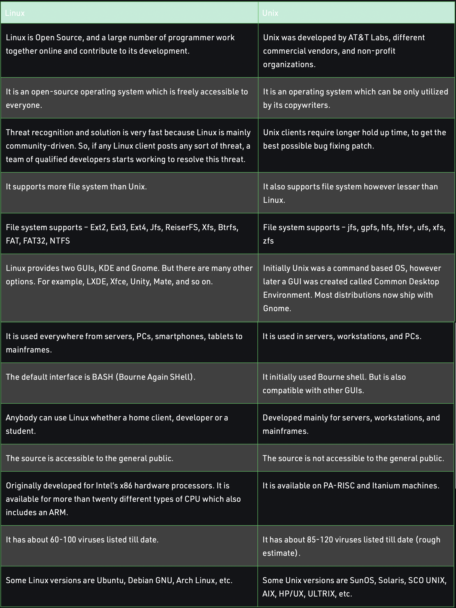

# Unix/Linux Questions

## What is the difference between Unix and Linux?
Linux is open-source and free to use the operating system. It is used for computer hardware and software, game development, mainframes, etc. It can run various client programs.

Unix is the most widely used operating systems. It is used in web servers, workstations, and PCs. Many business applications are accessible in it.

[Geeks for Geeks](https://www.geeksforgeeks.org/linux-vs-unix/)

## List some Linux distributions that we can use.

1. Debian
2. Gentoo
3. Ubuntu - one of the most popular Linux distros enjoyed across the globe by beginners, intermediate users, and professionals alike. Ubuntu was specifically designed for beginners in Linux or those transitioning from mac and Windows.
4. Linux Mint
5. Red Hat Enterprise Linux
6. CentOS
7. Fedora
8. Kali Linux
9. Arch Linux
10. OpenSUSE

[10 Linux Distributions and Their Targeted Users](https://www.tecmint.com/linux-distro-for-power-users/)

## Explain the terms:

### Terminal
The terminal is a program that provides the user with a simple command-line interface and performs the following 2 tasks:

1. Takes input from the user in the form of commands
2. Displays output on the screen

### Shell
After writing our commands on the terminal, when we press the Enter key, the terminal passes those commands to another program to figure out what the user wants to do, and in most cases, that program is the Shell, which forms the outer layer of Linux OS, which performs the following functions:

1. Interprets the command given by the end-user
2. Checks the syntax of the command and then Checks whether the command is correctly used or not.
3. If everything is correct, the shell converts the command Into a kernel-understandable form and passes it to the kernel. Else, It returns an error message 
4. The $ prompt appears on the terminal waiting for the next command, Irrespective of whether the previous commands were correct or not.

> The shell is the mediator or the interface between the end-user and the kernel.  

### Command line
The Command Line Interface (CLI), is a non-graphical, text-based interface to the computer system, where the user types in a command and the computer then successfully executes it. The Terminal is the platform or the IDE that provides the command line interface (CLI) environment to the user.

[Geeks for Geeks](https://www.geeksforgeeks.org/linux-operating-system-cli-command-line-interface-and-gui-graphic-user-interface/?ref=gcse)

## What is the bash shell? 
The Bash Shell is the shell created for GNU's UNIX clone. GNU wanted to create a free to distribute version of UNIX and they needed a sheel program. Stephen Bourne ultimately created the shell and it was named the Bash Shell (Bourne Again Shell)

## How would you make a bash script?

## What is the shebang? What is its purpose in a bash script?

## What is an environment variable and how would you set one on your local machine?

## What is the difference between relative and absolute paths? 

## Where are the root and home directories located? How to get to each? 

## What Linux command would you use to (be able to give the syntax for each): 

### Search for text in a text file 

### Navigate your file hierarchy on the command line? 

### List files? What about hidden files?  

### See permissions for the files? 

### Change the permissions of a file 

### Edit a file from the terminal

### Move a file to different folder

### Delete a file

## How do file permissions work on a Linux system?
