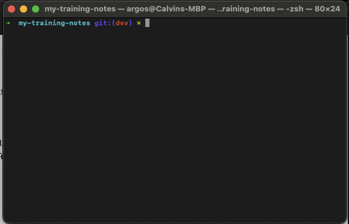
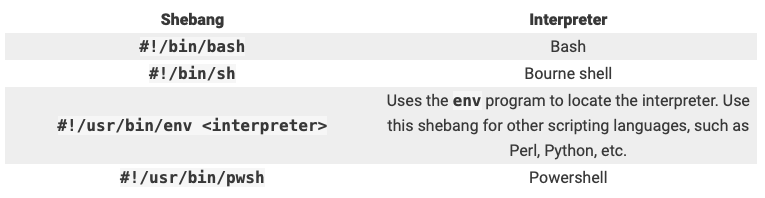
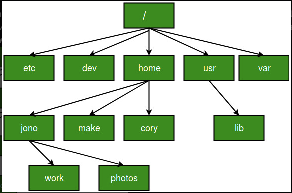
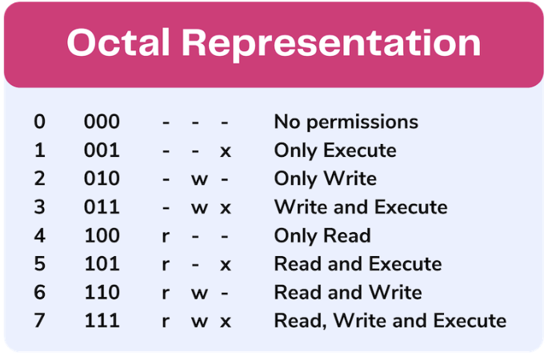

# Unix/Linux Questions

> Note: Don't forget about this document. [Revature Study Guide](https://sites.google.com/revature.com/studyguide/java?authuser=0). The references in this document are from the internet through google searches. These provide additional references to the material below.

## What is the difference between Unix and Linux?
Linux is open-source and free to use the operating system. It is used for computer hardware and software, game development, mainframes, etc. It can run various client programs.

Unix is the most widely used operating systems. It is used in web servers, workstations, and PCs. Many business applications are accessible in it.


[Geeks for Geeks](https://www.geeksforgeeks.org/linux-vs-unix/)

## List some Linux distributions that we can use.

1. Debian
2. Gentoo
3. Ubuntu - one of the most popular Linux distros enjoyed across the globe by beginners, intermediate users, and professionals alike. Ubuntu was specifically designed for beginners in Linux or those transitioning from mac and Windows.
4. Linux Mint
5. Red Hat Enterprise Linux
6. CentOS
7. Fedora
8. Kali Linux
9. Arch Linux
10. OpenSUSE

[10 Linux Distributions and Their Targeted Users](https://www.tecmint.com/linux-distro-for-power-users/)

## Explain the terms:

### Terminal
The terminal is a program that provides the user with a simple command-line interface and performs the following 2 tasks:

1. Takes input from the user in the form of commands
2. Displays output on the screen

### Shell
After writing our commands on the terminal, when we press the Enter key, the terminal passes those commands to another program to figure out what the user wants to do, and in most cases, that program is the Shell, which forms the outer layer of Linux OS, which performs the following functions:

1. Interprets the command given by the end-user
2. Checks the syntax of the command and then Checks whether the command is correctly used or not.
3. If everything is correct, the shell converts the command Into a kernel-understandable form and passes it to the kernel. Else, It returns an error message 
4. The $ prompt appears on the terminal waiting for the next command, Irrespective of whether the previous commands were correct or not.

> The shell is the mediator or the interface between the end-user and the kernel.  

### Command line
The Command Line Interface (CLI), is a non-graphical, text-based interface to the computer system, where the user types in a command and the computer then successfully executes it. The Terminal is the platform or the IDE that provides the command line interface (CLI) environment to the user.

[Geeks for Geeks](https://www.geeksforgeeks.org/linux-operating-system-cli-command-line-interface-and-gui-graphic-user-interface/?ref=gcse)

## What is the bash shell? 
The Bash Shell is the shell created for GNU's UNIX clone. GNU wanted to create a free to distribute version of UNIX and they needed a sheel program. Stephen Bourne ultimately created the shell and it was named the Bash Shell (Bourne Again Shell)

## How would you make a bash script?
1. Open terminal

	
	
2. Create a new file

```
vim script.sh
``` 
	
3. Add the "shebang"

```
#!/bin/bash
```

4. Add code and comments

```
#!/bin/bash
# A simple Bash script
sudo apt update -y
sudo apt upgrade -y
echo Done!
```

5. execute the script

```
bash script.sh
```

## What is the shebang? What is its purpose in a bash script?
The first line in Bash scripts is a character sequence known as the "shebang." The shebang is the program loader's first instruction when executing the file, and the characters indicate which interpreter to run when reading the script.

```
#!/bin/bash
```
> examples:



[phoenixNAP Global IT Services](https://phoenixnap.com/kb/write-bash-script)

## What is an environment variable and how would you set one on your local machine?

Environment variables or ENVs basically define the behavior of the environment. They can affect the processes ongoing or the programs that are executed in the environment.  

[Geeks for Geeks](https://www.geeksforgeeks.org/environment-variables-in-linux-unix/?ref=gcse)

## What is the difference between relative and absolute paths?

**Absolute path** is defined as the specifying the location of a file or directory from the root directory(/).
To write an absolute path-name:

Start at the root directory ( / ) and work down.
Write a slash ( / ) after every directory name (last one is optional)
For Example :

```
// Will work only if the fie “abc.sql” exists in your current directory.
$cat abc.sql

// However, if this file is not present in your working directory and is present somewhere else say in
// /home/kt , then this command will work only if you will use it like shown below:
$cat /home/kt/abc.sql
```

> Using . and .. in Relative Path-names
> .(a single dot) - this represents the current directory.
> ..(two dots) - this represents the parent directory. 

```
$pwd
/home/kt/abc
$cd ..               ***moves one level up***
$pwd
/home/kt
```

**Relative path** is defined as the path related to the present working directly(pwd). It starts at your current directory and never starts with a /.

> To be more specific let’s take a look on the below figure in which if we are looking for photos then absolute path for it will be provided as /home/jono/photos but assuming that we are already present in jono directory then the relative path for the same can be written as simple photos.



## Where are the root and home directories located? How to get to each? 
??

## What Linux command would you use to (be able to give the syntax for each): 

### Search for text in a text file

```
$ grep "string" "filename"
```
> (exclude the quotes)

[phoenixNAP](https://phoenixnap.com/kb/grep-command-linux-unix-examples)

### Navigate your file hierarchy on the command line?

To find out where your home directory is in relationship to the rest of the filesystem, you can use the pwd command. This command displays the directory that we are currently in:

```
$ pwd
// example response
Users/username/Library/Mobile Documents/com~apple~CloudDocs/_dev/my-training-notes/Week1_Review
```
> The home directory is named after the user account, so the above example is what the value would be if you were logged into the server with an account called username

If I wanted to move into the images sub-folder:

```
➜  Week1_Review git:(dev) ✗ cd images
// press return/enter
➜  images git:(dev) ✗ // Now in the images folder (Week1_Review/images) 
```

To move back to the "Week1_Review folder":

```
➜  images git:(dev) ✗ cd ..
// press return/enter
➜  Week1_Review git:(dev) ✗
```

> By the way my terminal (Calvin) looks this way due to a plugin you may see the $ instead

[Digital Ocean](https://phoenixnap.com/kb/grep-command-linux-unix-examples)

### List files? What about hidden files?

List files:

```
➜  Week1_Review git:(dev) ✗ ls
// press return/enter

// output for me:
DS_&_A_Questions.md     Java_Questions.md       Unix_Linux_Questions.md
Git_Questions.md        Other_Questions.md      images

show hidden files:
➜  Week1_Review git:(dev) ✗ ls -a
// press return/enter

// output for me:
.                       DS_&_A_Questions.md     Other_Questions.md
..                      Git_Questions.md        Unix_Linux_Questions.md
.DS_Store               Java_Questions.md       images

``` 

### See permissions for the files?

```
➜  Week1_Review git:(dev) ✗ ls -l

total 64
-rw-r--r--@  1 username  staff   427 Apr 23 10:39 DS_&_A_Questions.md
-rw-r--r--@  1 username  staff  5163 Apr 23 10:39 Git_Questions.md
-rw-r--r--   1 username  staff  7063 Apr 23 10:39 Java_Questions.md
-rw-r--r--   1 username  staff   278 Apr 23 10:39 Other_Questions.md
-rw-r--r--@  1 username  staff  7608 Apr 23 15:21 Unix_Linux_Questions.md
drwxr-xr-x@ 30 username  staff   960 Apr 23 14:44 images
```

### Change the permissions of a file 

First a permissions chart for reference:


> Medium: [Unix Permissions — The Easy Way - Semi Koen, September 20, 2020](https://towardsdatascience.com/unix-permissions-the-easy-way-98cc19979b3e)

Sometimes, we need to change the permissions of a directory and all its subfolders and files. In these cases, we use -R option to recursively apply permission to all subfolders and files:

```
chmod -R <permissions> <directory>
```

### Edit a file from the terminal

Here are two choices

```
// vim
➜  Week1_Review git:(dev) ✗ vim Java_Questions.md

//nano
➜  Week1_Review git:(dev) ✗ nano Java_Questions.md
```

### Move a file to different folder

```
➜  Week1_Review git:(dev) ✗ mv path/to/file/to/move/file.txt path/to/move/the/file/into/file.txt

// you can also change the file name while moving it.
➜  Week1_Review git:(dev) ✗ mv path/to/file/to/move/file.txt path/to/move/the/file/into/new_file_name.txt
```
[Apple Support](https://support.apple.com/guide/terminal/move-and-copy-files-apddfb31307-3e90-432f-8aa7-7cbc05db27f7/mac)

### Delete a file

```
// Here's what we have
➜  Week1_Review git:(dev) ✗ ls
DS_&_A_Questions.md     Other_Questions.md      images
Git_Questions.md        Unix_Linux_Questions.md
Java_Questions.md       file_to_delete.txt

// run the delete command
➜  Week1_Review git:(dev) ✗ rm file_to_delete.txt
➜  Week1_Review git:(dev) ✗ ls
DS_&_A_Questions.md     Java_Questions.md       Unix_Linux_Questions.md
Git_Questions.md        Other_Questions.md      images
➜  Week1_Review git:(dev) ✗ 

// file_to_delete.txt is now gone.
```

[How-To-Geek: How to Delete Files and Directories in the Linux Terminal - Dave McKay April 1, 2019](https://www.howtogeek.com/409115/how-to-delete-files-and-directories-in-the-linux-terminal/)

## How do file permissions work on a Linux system?

The basic Linux permissions model works by associating each system file with an owner and a group and assigning permission access rights for three different classes of users:

File Owner
Group Members
Others

[linuxize: Understanding Linux File Permissions](https://www.howtogeek.com/409115/how-to-delete-files-and-directories-in-the-linux-terminal/)
