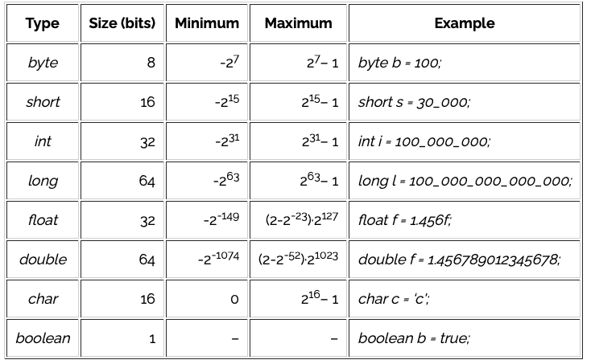

# Java Questions

> Note: Don't forget about this document. [Revature Study Guide](https://sites.google.com/revature.com/studyguide/java?authuser=0). The references in this document are from the internet through google searches. These provide additional references to the material below.

> Documented by Calvin Raines and Santiago Garcia II

## What is Java?
Java is the #1 programming language and development platform. Java is a programming language and computing platform which has evolved from humble beginnings to power a large share of today’s digital world, by providing the reliable platform upon which many services and applications are built.

Java is a high-level programming language that is multi-threading, secure, strongly- typed and derived from C.

Java is “write once, run anywhere” (WORA) meaning that compiled Java code can run on all platforms that support Java without the need for recompilation.

[Oracle.com](https://www.oracle.com/java/)
[Java.com](https://www.java.com/en/download/help/whatis_java.html)

## What are some of the features/benefits of Java and what do they mean?

* Multithreading – is a technique that allows for concurrent execution of two or more parts of a program for maximum utilization of a CPU.
* Platform independent
* Object Oriented
* Simple (easy to learn)
* Secure
* Strongly Typed
* Automatic memory management

## What is JRE / JDK / JVM?

### JRE
The Java Runtime Environment, or JRE, is a software layer that runs on top of a computer’s operating system software and provides the class libraries and other resources that a specific Java program needs to run.

### JDK
The Java Development Kit, or JDK, is a set of tools for developing Java applications. Developers choose JDKs by Java version and by package or edition—Java Enterprise Edition (Java EE), Java Special Edition (Java SE), or Java Mobile Edition (Java ME). Every JDK always includes a compatible JRE, because running a Java program is part of the process of developing a Java program.

### JVM
The Java Virtual Machine, or JVM, executes live Java applications. Every JRE includes a default JRE, but developers are free to choose another that meets the specific resource needs of their applications.

*Java compiler turns the code into bytecode and JVM interprets byte code into machine code which runs on different platforms such as windows, Linux, MacOS.*

[IBM](https://www.ibm.com/cloud/learn/jre)

## What is the difference between an object and a class?

### Class
The building block that leads to Object-Oriented Programming. It is a user-defined data type, that holds its own data members and member functions, which can be accessed and used by creating an instance of that class. It is the blueprint of any object.

### Object
an instance of a class. All data members and member functions of the class can be accessed with the help of objects. When a class is defined, no memory is allocated but when it is instantiated (i.e. an object is created), memory is allocated.

[Geeks for Geeks](https://www.geeksforgeeks.org/difference-between-class-and-object/)

## What is the root class from which every class extends? 
Java.lang.Object class is the root or superclass of the class hierarchy, which is present in java.lang package. All predefined classes and user-defined classes are the subclasses from Object class.

[Tutorialspoint.com](https://www.tutorialspoint.com/why-object-class-is-the-super-class-for-all-classes-in-java)

## What are the primitive data types in Java?



### boolean
* true, false - either 0, or 1

Declare a boolean:

```
boolean b = true;

boolean b;
```

### byte
* similar to int, but takes up 8 bits of memory
* values between -128 & 127 (inclusive)

Declare a byte:

```
byte b = 100;

byte empty;
```

### int (integer)
* int type holds a wide range of non-fractional number values
* Java stores it using 32 bits of memory

Declare a int:

```
int x = 424_242;

int y;
```

### short
* also similar to int, but larger than byte.
* 16 bits of memory
* range of -32.768 to 32.767 (inclusive)

Declare a short:

```
short s = 20_020;

short s;
```

### long
* related to int, but it is larger
* It's stored in 64 bits of memory
* range -9,223,372,036,854,775,808 to 9,223,372,036,854,775,807 (inclusive)

Declare a long:

```
long l = 1_234_567_890;

long l;
```

### double
* It's stored in 64 bits of memory. 
* Range is 4.9406564584124654 to 1.7976931348623157 (positive and negative - inclusive)

Declare a double:

```
double d = 3.13457599923384753929348D;

double d;
```

### float
* This type is stored in 32 bits of memory just like int.
* Range is 1.40239846 x 10-45, and the largest value is 3.40282347 x 1038 (positive and negative - inclusive).

Declare a float:

```
float f = 3.145f;

float f;
```

### char (character)
* 16-bit integer representing a Unicode-encoded character.
* Range is from 0 to 65,535. In Unicode, this represents ‘\u0000' to ‘\uffff'

Declare a char:

```
char c = 'a';

char c = 65;

char c;
```

[Baeldung](https://www.baeldung.com/java-primitives)

## Explain stack vs heap

To run an application in an optimal way, JVM divides memory into stack and heap memory. Whenever we declare new variables and objects, call a new method, declare a String, or perform similar operations, JVM designates memory to these operations from either Stack Memory or Heap Space.

### Stack
Stack Memory in Java is used for static memory allocation and the execution of a thread. It contains primitive values that are specific to a method and references to objects referred from the method that are in a heap.

Access to this memory is in Last-In-First-Out (LIFO) order. Whenever we call a new method, a new block is created on top of the stack which contains values specific to that method, like primitive variables and references to objects.

Some other features of stack memory include:

* It grows and shrinks as new methods are called and returned, respectively.
* Variables inside the stack exist only as long as the method that created them is running.
* It's automatically allocated and deallocated when the method finishes execution.
* If this memory is full, Java throws java.lang.StackOverFlowError.
* Access to this memory is fast when compared to heap memory.
* This memory is threadsafe, as each thread operates in its own stack.

### Heap
Heap space is used for the dynamic memory allocation of Java objects and JRE classes at runtime.

New objects are always created in heap space, and the references to these objects are stored in stack memory.

These objects have global access and we can access them from anywhere in the application.

1. **Young Generation** – this is where all new objects are allocated and aged. A minor Garbage collection occurs when this fills up.
2. **Old or Tenured Generation** – this is where long surviving objects are stored. When objects are stored in the Young Generation, a threshold for the object's age is set, and when that threshold is reached, the object is moved to the old generation.
3. **Permanent Generation** – this consists of JVM metadata for the runtime classes and application methods.

[Baeldung](https://www.baeldung.com/java-stack-heap)

## Where are Strings stored in memory?
In Java, strings are stored in the heap area.

> Why Java strings stored in Heap, not in Stack? 
> String is a class and strings in java treated as an object, hence the object of String class will be stored in Heap, not in the stack area.

[Geeks for Geeks: Storage of String in Java](https://www.geeksforgeeks.org/storage-of-string-in-java/)

## Are variable references stored on the stack or heap? What about the objects they refer to?

### Stack
Variable references are stored in the stack

### Heap
The objects to which they refer are stored in the heap.

## What is a stack trace? What kind of information do they tell you?

### Stack Trace
A stack trace is a list of the method calls that the application was in the middle of when an Exception was thrown.

> The stack trace can assist in finding where a bug is present in an application.

## What are annotations?

## What is a POJO?
a plain old Java object (POJO) is an ordinary Java object, not bound by any special restriction.

## Explain the POJO Design Pattern. 
Using either abstract classes or interfaces to modularize our applications to better manage our business logic

**Business Object** - Business Service fills the Transfer Object with data.

**Transfer Object** - Simple POJO having methods to set/get attributes only.

**Client** - Client either requests or sends the Transfer Object to Business Object.

## What is garbage colleciton?
The process by which Java programs perform automatic memory management
 
## Can you force garbage collection in Java? When is an object eligible for GC? 
An object is eligible for garbage collection when there are no more references to that object. References that are held in a variable are usually dropped when the variable goes out of scope. Or, you can explicitly drop an object reference by setting the variable to the special value null.

## Why are strings immutable in java? How would you make your own objects immutable?
String is immutable in Java because of the security, synchronization and concurrency, caching, and class loading. The reason of making string final is to destroy the immutability and to not allow others to extend it. The String objects are cached in the String pool, and it makes the String immutable.

## What is the difference between String, StringBuilder, and StringBuffer? 
Objects of String are immutable, and objects of StringBuffer and StringBuilder are mutable. StringBuffer and StringBuilder are similar, but StringBuilder is faster and preferred over StringBuffer for the single-threaded program. If thread safety is needed, then StringBuffer is used.

## What are the different variable scopes in Java?
there are three types of variables based on their scope: Member Variables (Class Level Scope) Local Variables (Method Level Scope)

## What are the access modifiers in Java? Explain them.

**Private**: We can access the private modifier only within the same class and not from outside the class.

**Default**: We can access the default modifier only within the same package and not from outside the package. And also, if we do not specify any access modifier it will automatically consider it as default.

**Protected**: We can access the protected modifier within the same package and also from outside the package with the help of the child class. If we do not make the child class, we cannot access it from outside the package. So inheritance is a must for accessing it from outside the package.

**Public**: We can access the public modifier from anywhere. We can access public modifiers from within the class as well as from outside the class and also within the package and outside the package.

[Great Learning: Access Modifiers in JAVA](https://www.mygreatlearning.com/blog/the-access-modifiers-in-java/) 

## What are the non-access modifiers in Java? 
Non-access: static, final, abstract, synchronized, volatile, transient and native 

## What is the difference between static and final variables? 
static is used to define the class member that can be used independently of any object of the class. In contrast, final is used to declare a constant variable or a method that cannot be overridden or a class that cannot be inherited.

## What are the default values for all data types in Java? 
Byte: 0

Short: 0

Int: 0

Long: 0

Float: 0.0

Double: 0.0

Boolean: false

Char: \u0000 or null

## What is a wrapper class? List them. 
Wrapper classes provide a way to use primitive data types (int, boolean, etc..) as objects.

Data Type/Wrapper Class
byte/Byte
short/Short
int/Integer
long/Long
float/Float
double/Double
boolean/Boolean
char/Character

## What is autoboxing / unboxing? 
Autoboxing is the automatic conversion that the Java compiler makes between the primitive types and their corresponding object wrapper classes. For example, converting an int to an Integer, a double to a Double, and so on. If the conversion goes the other way, this is called unboxing.

## Is Java pass-by-value or pass-by-reference? 
Arguments in Java are always passed-by-value. During method invocation, a copy of each argument, whether its a value or reference, is created in stack memory which is then passed to the method.

## How can you make a class immutable? 
To create an immutable class in Java, you have to do the following steps.

1.Declare the class as final so it can’t be extended.
2.Make all fields private so that direct access is not allowed.
3.Don’t provide setter methods for variables.
4.Make all mutable fields final so that its value can be assigned only once.
5.Initialize all the fields via a constructor performing deep copy.
6.Perform cloning of objects in the getter methods to return a copy rather than returning the actual object reference.

## If two objects are equal, do they have the same hashcode? If not equal? 
If two objects have the same hashcode then they are NOT necessarily equal. Otherwise you will have discovered the perfect hash function. But the opposite is true: if the objects are equal, then they must have the same hashcode .

## What is a conditional statement? What are the different types?
is equipped with specific statements that allow us to check a
condition and execute certain parts of code depending on whether the condition is true or false. Such statements
are called conditional, and are a form of composite statement.

Conditional Statements In Java
if statement.
nested if statement.
if-else statement.
if-else-if statement.
Switch Case Statement.


## What data types are supported in switch statements? 
The switch statement works with byte, short, int, long, enum types, String and some wrapper types like Byte, Short, Int, and Long.

## What is a method?
A block of code which only runs when it is called.

You can pass data, known as parameters, into a method.

Methods are used to perform certain actions, and they are also known as functions.

Why use methods? To reuse code: define the code once, and use it many times.

## What is the difference between a package and an import in Java?
Package is used to put all one Module related into one specified Folder for a better understanding ,whereas import is used to import the specific class that we need to run our application/class(Like we use Java. Util...etc).

## Can an import be static? Give an example of one. 
static import allows to access the static members of a class without class qualifications.we can access the static members of a class directly without class name or any object For Example, to access the static methods you need to call the using class name: Math.

## What methods are available in the Object class? 
Java Object getClass() returns the class name of the object.
Java Object hashCode() returns the hashcode value of the object.
Java Object toString() converts an object into the string.
Java Object equals() checks if two objects are equal.
Java Object clone() creates a copy of the object.

## What is the difference between == and .equals()? 
**==** checks if both objects point to the same memory location 

**.equals()** evaluates to the comparison of values in the objects. If a class does not override the equals method, then by default, it uses the equals(Object o) method of the closest parent class that has overridden this method.

## What is an enhanced for loop? 
The enhanced for loop was introduced in Java 5 as a simpler way to iterate through all the elements of a Collection. It can also be used for arrays, as in the above example, but this is not the original purpose. Enhanced for loops are simple but inflexible.

## What does the “super” keyword do? 
refers to superclass (parent) objects. It is used to call superclass methods, and to access the superclass constructor.

## What is the first line of any constructor? 
first line of a constructor must either be a call on another constructor in the same class (using this ), or a call on the superclass constructor (using super ). If the first line is neither of these, the compiler automatically inserts a call to the parameterless super class constructor.

## What happens if you don’t define a constructor for a class? Can you still instantiate it? 
If we don't define a constructor in a class, then the compiler creates a default constructor(with no arguments) for the class. And if we write a constructor with arguments or no-arguments then the compiler does not create a default constructor.

## What is a literal value in Java?
Any constant value which can be assigned to the variable is called literal/constant. 

In simple words, Literals in Java is a synthetic representation of boolean, numeric, character, or string data. It is a medium of expressing particular values in the program, such as an integer variable named ‘’/count is assigned an integer value in the following statement.

## What are operators? List some operators.
Arithmetic operators are used to perform common mathematical operations.

**+**	Addition	Adds together two values

```
x + y	
```

**-**	Subtraction	Subtracts one value from another

```
x - y
```

**\***	Multiplication	Multiplies two values

```
x * y
```

**/**	Division	Divides one value by another

```
x / y
```

**%**	Modulus	Returns the division remainder

```
x % y
```

**++**	Increment	Increases the value of a variable by 1

```
++x	
```

**--**	Decrement	Decreases the value of a variable by 1

```
--x
```

## What is the compliation process that our Java code goes through?
Java source code is compiled into bytecode when we use the javac compiler. The bytecode gets saved on the disk with the file extension . class . When the program is to be run, the bytecode is converted, using the just-in-time (JIT) compiler

## What is the difference between final, .finalize(), and finally?

### Final
### .finalize()
### finally

## What is the difference between final, .finalize(), and finally? 
**Finally** is the block in Java Exception Handling to execute the important code whether the exception occurs or not.
**finalize()** is the method in Java which is used to perform clean up processing just before object is garbage collected. 
**Final** keyword is used with the classes, methods and variables.

## What is an exception? What makes it different from an error?
An Error "indicates serious problems that a reasonable application should not try to catch." An Exception "indicates conditions that a reasonable application might want to catch." Error along with RuntimeException & their subclasses are unchecked exceptions. All other Exception classes are checked exceptions.

## Explain the difference between throw, throws, and Throwable 
throws : Used when writing methods, to declare that the method in question throws the specified (checked) exception.

As opposed to checked exceptions, runtime exceptions (NullPointerExceptions etc) may be thrown without having the method declare throws NullPointerException.

throw: Instruction to actually throw the exception. (Or more specifically, the Throwable).

The throw keyword is followed by a reference to a Throwable (usually an exception).

## Do you need a try block? 
It must be used within the method. If an exception occurs at the particular statement in the try block, the rest of the block code will not execute. So, it is recommended not to keep the code in try block that will not throw an exception. Java try block must be followed by either catch or finally block.

## Do you need a catch block? 
It is not necessary to catch all exceptions. In Java there is two types of exceptions: checked and unchecked. The rule is simple a checked exception has to be handled by the caller while an unchecked exception can be handled either by not catching it, or by catching it.

## What is Java? What are some of the features/benefits of Java and what do they mean?
Java is platform-independent. Some programs developed in one machine can be executed in another machine. It is designed for building object-oriented applications. It is a multithreaded language with automatic memory management. It is created for the distributed environment of the Internet.

## What is JRE / JDK / JVM? 
JRE (Java Runtime Environment) is an installation package that provides an environment to only run(not develop) the java program(or application)onto your machine. JRE is only used by those who only want to run Java programs that are end-users of your system.

Java Development Kit (JDK) is a software development environment used for developing Java applications and applets. It includes the Java Runtime Environment (JRE), an interpreter/loader (Java), a compiler (javac), an archiver (jar), a documentation generator (Javadoc), and other tools needed in Java development. 

JVM (Java Virtual Machine) is a very important part of both JDK and JRE because it is contained or inbuilt in both. Whatever Java program you run using JRE or JDK goes into JVM and JVM is responsible for executing the java program line by line, hence it is also known as an interpreter.

## What is the difference between an object and a class? 
 A class is a template used for the creation of objects. An object is an instance of a class. While a class is a logical entity, an object is a physical entity. Each object has a state in which all the member variables have specific values.

## What is the root class from which every class extends? 
Object class is the root or superclass of the class hierarchy, which is present in java. lang package. All predefined classes and user-defined classes are the subclasses from Object class.

## Explain stack vs heap
Java Heap Space is used throughout the application, but Stack is only used for the method — or methods — currently running. The Heap Space contains all objects are created, but Stack contains any reference to those objects. Objects stored in the Heap can be accessed throughout the application.

## Where are Strings stored in memory? 
strings are stored in the heap area.

## Are variable references stored on the stack or heap? What about the objects they refer to? 
All objects in Java are stored on the heap. The "variables" that hold references to them can be on the stack or they can be contained in other objects (then they are not really variables, but fields), which puts them on the heap also.

## What is a stack trace? What kind of information do they tell you? 
represents the call stack at a given point in time, with each element representing a method execution. Generally, a stack trace is generated when an Exception is not handled properly in code. (Exceptions inform you when your code has an error.)

## What are annotations? 
metadata (data about data) for our program source code. They provide additional information about the program to the compiler but are not part of the program itself. These annotations do not affect the execution of the compiled program. Let's take an example of @Override annotation.

## What is garbage colleciton?
The process by which Java programs perform automatic memory management. Java programs compile to bytecode that can be run on a Java Virtual Machine, or JVM for short. When Java programs run on the JVM, objects are created on the heap, which is a portion of memory dedicated to the program.

## Can you force garbage collection in Java? When is an object eligible for GC? 
An object is eligible to be garbage collected if its reference variable is lost from the program during execution. Sometimes they are also called unreachable objects. What is reference of an object? The new operator dynamically allocates memory for an object and returns a reference to it

## Why are strings immutable in java? How would you make your own objects immutable?
the immutable string or objects that cannot be modified once it is created. But we can only change the reference to the object. We restrict to change the object itself. The String is immutable in Java because of the security, synchronization and concurrency, caching, and class loading.

## What is JUnit? 
A unit testing framework for the Java programming language. JUnit has been important in the development of test-driven development, and is one of a family of unit testing frameworks which is collectively known as xUnit that originated with SUnit. JUnit is linked as a JAR at compile-time.

## What is TDD? 
is a software development process which includes test-first development. It means that the developer first writes a fully automated test case before writing the production code to fulfil that test and refactoring.

## What are the annotations in JUnit? Order of execution? 
Unit4 are:

@BeforeClass
@AfterClass
@Before
@After

## What are assertions?
is a statement in the JavaTM programming language that enables you to test your assumptions about your program. For example, if you write a method that calculates the speed of a particle, you might assert that the calculated speed is less than the speed of light.

## Give an example of a test case 
two types of unit testing possible, Manual testing and Automated testing. Manual testing is a special type of testing in which the test cases are executed without using any tool. Unlike manual testing, automated testing is not possible without supporting any tool.

The org.junit package provides several classes and packages, which helps us to ensure whether our code provides the expected output or not. These packages and classes are Assert, After, Before, and Test, etc.
JunitTestCaseExample.java

package JavaTpoint. JunitExamples;  

```
import java.util.ArrayList;  
import java.util.List;  
public class JunitTestCaseExample {  
    private List<String> students = new ArrayList<String>();  
  
    public void remove(String name) {  
        students.remove(name);  
    }  
      
    public void add(String name) {  
        students.add(name);  
    }  
      
    public void removeAll(){  
        students.clear();  
    }  
      
    public int sizeOfStudent() {  
        return students.size();  
    }  
      
}
```

TestJunitTestCaseExample.java

```
package JavaTpoint.JunitExamples;  
import static org.junit.Assert.assertEquals;  
import org.junit.Test;  
public class TestJunitTestCaseExample {  
           
    JunitTestCaseExample obj = new JunitTestCaseExample();  
     
    @Test  
    public void testAdd() {  
        obj.add("Emma");  
        obj.add("Ronan");  
        obj.add("Antonio");  
        obj.add("Paul");  
        assertEquals("Adding 4 student to list", 4, obj.sizeOfStudent());  
    }  
      
    @Test  
    public void testSize() {  
        obj.add("Emma");  
        obj.add("Ronan");  
        obj.add("Antonio");  
        assertEquals("Checking size of List", 3, obj.sizeOfStudent());  
    }  
      
    @Test  
    public void testRemove() {  
        obj.add("Antonio");  
        obj.add("Paul");  
        obj.remove("Paul");  
        assertEquals("Removing 1 student from list", 1, obj.sizeOfStudent());  
    }  
      
    @Test  
    public void removeAll() {  
        obj.removeAll();  
    }  
}

```

TestRunner.java

```
package JavaTpoint.JunitExamples;    
import org.junit.runner.Result;  
import org.junit.runner.JUnitCore;  
import org.junit.runner.notification.Failure;  
  
public class TestRunner {  
   public static void main(String[] args) {  
      Result result = JUnitCore.runClasses(TestJunitTestCaseExample.class);  
          
      for (Failure fail : result.getFailures()) {  
         System.out.println(fail.toString());  
      }  
          
      System.out.println(result.wasSuccessful());  
   }  
}
```

Explanation

We have created three java classes, i.e., JunitTestCaseExample.java, TestJunitTestCaseExample.java, and TestRunner.java. In the JunitTestCaseExample.java class, we created the code which we want to test. In this class, we create a list of names and four methods to add an element, remove an element, get the list's size, and remove all elements from the list.

In the TestJunitTestCaseExample.java, we write the test cases for the JunitTestCaseEample.java class. We create an object of the JunitTestCaseExample.java class, and by using its object, we will test all its methods. We use the assertEquals() method to check the actual result with the expected output.

We create the TestRunner.java class to execute the test cases. It contains the main() method in which we run the TestJunitTestCaseExample.java class using the runClasses() method of the JUnitCore. In this method, we pass the class file of the TestJunitTestCaseExample.java. The result returned by the runClasses() method will store into the result variable of type Result.


## How would you prevent a test from being run without commenting it out?
@Ignore annotation is in a package org.junit so you need to add import statement

import org.junit.Ignore;
or

import org.junit.*;

> Next time you have a problem like this you can just google class name (e.g. junit @Ignore) go to the documentation page and check package name.

> In NetBeans you can use "Source -> Fix Imports" command (Ctrl + Shift + I) and IDE will try to resolve necessary imports automatically.

## What is Mockito? How do you use it in a test case?
Mockito records the interaction with mock and allows you to check if the mock object was used correct, e.g. if a certain method has been called on the mock. This allows you to implement behavior testing instead of only testing the result of method calls.

## What is the difference between a mock and a stub?
**Mocks** verify the behavior of the code you're testing, also known as the system under test. Mocks should be used when you want to test the order in which functions are called.

**Stubs** verify the state of the system under test.

## What is the difference between a parameter and an argument?
**Java argument** is a variable whose value is passed into a function and is used whenever a function is called. 

**The parameter** is the value that is defined in a functional block. So, it is basically used whenever we need to pass a value to a particular functional block.

## What are collections in Java? 
The Java collections framework is a set of classes and interfaces that implement commonly reusable collection data structures. Although referred to as a framework, it works in a manner of a library. The collections framework provides both interfaces that define various collections and classes that implement them

## What are the interfaces in the Collections API? 
The Collection interface is a member of the Java Collections Framework. It is a part of java.util package. It is one of the root interfaces of the Collection Hierarchy. The Collection interface is not directly implemented by any class. However, it is implemented indirectly via its subtypes or subinterfaces like List, Queue, and Set.

## What is the difference between an Array and an ArrayList?
An array is a basic functionality provided by Java, whereas ArrayList is a class of Java Collections framework. It belongs to java.util package.

An array is a dynamically-created object. It serves as a container that holds the constant number of values of the same type. It has a contiguous memory location. Once an array is created, we cannot change its size. We can create an array by using the following statement:

```
int array[]=new int[size];
```
Java ArrayList class

In Java, ArrayList is a class of Collections framework. It implements List<E>, Collection<E>, Iterable<E>, Cloneable, Serializable, and RandomAccess interfaces. It extends AbstractList<E> class

We can create an instance of ArrayList by using the following statement:

```
ArrayList<Type> arrayList=new ArrayList<Type>();
```
 
## What is the difference between an Array and an ArrayList? 
An array is a fixed-length data structure. ArrayList is a variable-length data structure. It can be resized itself when needed. It is mandatory to provide the size of an array while initializing it directly or indirectly.

## Are Maps in the Collections API? What makes Map different from other interfaces? 
A Map is an object that maps keys to values. A map cannot contain duplicate keys: Each key can map to at most one value. It models the mathematical function abstraction. The Map interface includes methods for basic operations (such as put, get, remove, containsKey, containsValue, size, and empty), bulk operations (such as putAll and clear), and collection views (such as keySet, entrySet, and values).

The Java platform contains three general-purpose Map implementations: HashMap, TreeMap, and LinkedHashMap. Their behavior and performance are precisely analogous to HashSet, TreeSet, and LinkedHashSet, as described in The Set Interface section.

## List several ways to iterate over a Collection. How would you iterate over an ArrayList? 
ArrayList is a part of collection framework and is present in java.util package. It provides us with dynamic arrays in Java. Though, it may be slower than standard arrays but can be helpful in programs where lots of manipulation in the array is needed. This class is found in java.util package.

With the introduction and upgradations in java versions, newer methods are being available as if we do see from Java8 perceptive lambda expressions and streams concepts were not available before it as it been introduced in java version8.

Methods:

Using for loops
Using while
Using for-each loop
Using Iterator
Using Lambda expressions (after Java8 only)
Using Enumeration interface

## What is the purpose of the Iterable interface? What about Iterator? 
It belongs to java.
In general, an object Implementing Iterable allows it to be iterated. An iterable interface allows an object to be the target of enhanced for loop(for-each loop). Here, T is the type of element returned by the Iterator.

## What is the difference between the Comparable and Comparator interfaces? 
Comparable interface is used to sort the objects with natural ordering. Comparator in Java is used to sort attributes of different objects. 
Comparable interface compares “this” reference with the object specified. Comparator in Java compares two different class objects provided.

## What are generics? What is the diamond operator (<>)? 

 Generics means parameterized types. The idea is to allow type (Integer, String, … etc., and user-defined types) to be a parameter to methods, classes, and interfaces. Using Generics, it is possible to create classes that work with different data types. An entity such as class, interface, or method that operates on a parameterized type is a generic entity.
 
 diamond operator adds type inference and reduces the verbosity in the assignments 

## Create and instantiate a generic class. Create and use a generic method.

// Java program to show working of user defined
// Generic classes
  
// We use < > to specify Parameter type
class Test<T> {
    // An object of type T is declared
    T obj;
    Test(T obj) { this.obj = obj; } // constructor
    public T getObject() { return this.obj; }
}
  
// Driver class to test above
class Main {
    public static void main(String[] args)
    {
        // instance of Integer type
        Test<Integer> iObj = new Test<Integer>(15);
        System.out.println(iObj.getObject());
  
        // instance of String type
        Test<String> sObj
            = new Test<String>("GeeksForGeeks");
        System.out.println(sObj.getObject());
    }
}

## What is the generic wildcard? What does it mean? How do you use in your Java code?
The question mark (?) is known as the wildcard in generic programming. It represents an unknown type. The wildcard can be used in a variety of situations such as the type of a parameter, field, or local variable; sometimes as a return type.

## How do you serialize / deserialize an object in Java? 
Serialization is a mechanism of converting the state of an object into a byte stream. Deserialization is the reverse process where the byte stream is used to recreate the actual Java object in memory. This mechanism is used to persist the object.
The byte stream created is platform independent. So, the object serialized on one platform can be deserialized on a different platform.

To make a Java object serializable we implement the java.io.Serializable interface.
The ObjectOutputStream class contains writeObject() method for serializing an Object.

## Difference between FileReader and BufferedReader? 
FileReader and BufferedReader are two classes to perform operations on files. The main difference between FileReader and BufferedReader in Java is that FileReader reads characters from a file while BufferedReader reads characters from another Reader.

## Explain the try-with-resources syntax 
The try -with-resources statement is a try statement that declares one or more resources. A resource is an object that must be closed after the program is finished with it. The try -with-resources statement ensures that each resource is closed at the end of the statement. Any object that implements java.

## List some methods in the Scanner class 
The Scanner class provides various methods that allow us to read inputs of different types.

Method	Description
nextInt()	reads an int value from the user
nextFloat()	reads a float value form the user
nextBoolean()	reads a boolean value from the user
nextLine()	reads a line of text from the user
next()	reads a word from the user
nextByte()	reads a byte value from the user
nextDouble()	reads a double value from the user
nextShort()	reads a short value from the user
nextLong()	reads a long value from the user

## What is Maven?
Maven is a build automation tool used primarily for Java projects. Maven can also be used to build and manage projects written in C#, Ruby, Scala, and other languages. The Maven project is hosted by the Apache Software Foundation, where it was formerly part of the Jakarta Project.

## Where / when does Maven retrieve dependencies from? Where are they stored locally? 
When you run a Maven build, then Maven automatically downloads all the dependency jars into the local repository. It helps to avoid references to dependencies stored on remote machine every time a project is build. Maven local repository by default get created by Maven in %USER_HOME% directory.

# What is the POM and what is the pom.xml? 
POM is an acronym for Project Object Model. The pom. xml file contains information of project and configuration information for the maven to build the project such as dependencies, build directory, source directory, test source directory, plugin, goals etc. Maven reads the pom.

## What are the OOP Pillars? What do each of them mean?

> Be able to give a definition, real-life example, and Java-related example about each of the pillars:

### Abstraction
There are two ways to achieve abstraction in Java

Abstract class (0 to 100%)
Interface (100%)

> Real-Life Example: A driver will focus on the car functionality (Start/Stop -> Accelerate/ Break), he/she does not bother about how the Accelerate/ brake mechanism works internally. And this is how the abstraction works.

Certain key points should be remembered regarding this pillar of OOPS as follows:

The class should be abstract if a class has one or many abstract methods
An abstract class can have constructors, concrete methods, static method, and final method
Abstract class can’t be instantiated directly with the new operator. It can be possible as shown in pre tag below:

### Polymorphism
Polymorphism is the ability to perform many things in many ways. The word Polymorphism is from two different Greek words- poly and morphs. “Poly” means many, and “Morphs” means forms. So polymorphism means many forms. The polymorphism can be present in the case of inheritance also. The functions behave differently based on the actual implementation.

> Real-life Example:

> A delivery person delivers items to the user. If it’s a postman he will deliver the letters. If it’s a food delivery boy he will deliver the foods to the user. Like this polymorphism implemented different ways for the delivery function.


There are two types of polymorphism as listed below:

* Static or Compile-time Polymorphism
* Dynamic or Run-time Polymorphism

**Static** or Compile-time Polymorphism when the compiler is able to determine the actual function, it’s called compile-time polymorphism.

**Compile-time** polymorphism can be achieved by method overloading in java. When different functions in a class have the same name but different signatures, it’s called method overloading. A method signature contains the name and method arguments. So, overloaded methods have different arguments. The arguments might differ in the numbers or the type of arguments.

### Inheritance
Inheritance is the process of one class inheriting properties and methods from another class in Java. Inheritance is used when we have is-a relationship between objects.  Inheritance in Java is implemented using extends keyword.

> Real-life Example:

> The planet Earth and Mars inherits the super class Solar System and Solar system inherits the Milky Way Galaxy. So Milky Way Galaxy is the top super class for Class Solar System, Earth and Mars.

> Let us do discuss the usage of inheritance in java applications with a generic example before proposing the code. So consider an example extending the Exception class to create an application-specific Exception class that contains more information like error codes. For example NullPointerException.

There are 5 different types of inheritance in java as follows:

* Single Inheritance: Class B inherits Class B using extends keyword
* Multilevel Inheritance: Class C inherits class B and B inherits class A using extends keyword
* Hierarchy Inheritance: Class B and C inherits class A in hierarchy order using extends keyword
* Multiple Inheritance: Class C inherits Class A and B. Here A and B both are superclass and C is only one child class. Java is not supporting Multiple Inheritance, but we can implement using Interfaces.
* Hybrid Inheritance: Class D inherits class B and class C. Class B and C inherits A. Here same again Class D inherits two superclass, so Java is not supporting Hybrid Inheritance as well.

### Encapsulation
Encapsulation is the process of wrapping code and data together into a single unit.

> Real-Life Example:

> A capsule which is mixed of several medicines. The medicines are hidden data to the end user.

In order to achieve encapsulation in java follow certain steps as proposed below:

* Declare the variables as private
* Declare the setters and getters to set and get the variable values

There are few disadvantages of encapsulation in java as follows:

* Control Over Data: We can write the logic in the setter method to not store the negative values for an Integer. So by this way we can control the data.
* Data Hiding: The data members are private so other class can’t access the data members.

Easy to test: Unit testing is easy for encapsulated classes
 
## What are states in OOP? Behaviors?
State simply means data or value. Behavior means action or work or task or operation that the object does

## What is shadowing?\*
Shadowing in Java is the practice of using variables in overlapping scopes with the same name where the variable in low-level scope overrides the variable of high-level scope.

```
// Java program to demonstrates Shadowing in Java
 
// Class 1 and 2
// Outer Class
class Shadowing {
 
    // Instance variable or member variable
    String name = "Outer John";
 
    // Nested class
    // Inner Class
    class innerShadowing {
 
        // Instance variable or member variable
        String name = "Inner John";
 
        // Method of inner class
        // To print the content
        public void print(String name)
        {
 
            // Print statements
 
            System.out.println(name);
            // This keyword refers to current instance
            // itself
            System.out.println(this.name);
            System.out.println(Shadowing.this.name);
        }
    }
}
 
// Class 3
// Main class
class GFG {
 
    // Main driver method
    public static void main(String[] args)
    {
 
        // Accessing an inner class by
        // creating object of Outer class inside main()
        // method
        Shadowing obj = new Shadowing();
 
        Shadowing.innerShadowing innerObj
            = obj.new innerShadowing();
 
        // Function Call
        innerObj.print("Parameter John");
    }
}
```
Output

```
Parameter John
Inner John
Outer John
```

## What is a covariant? 
Covariant return type refers to return type of an overriding method. It allows to narrow down return type of an overridden method without any need to cast the type or check the return type. Covariant return type works only for non-primitive return types.

From Java 5 onwards, we can override a method by changing its return type only by abiding the condition that return type is a subclass of that of overridden method return type.

<hr>

\* Reviewed item edited by Calvin Raines
