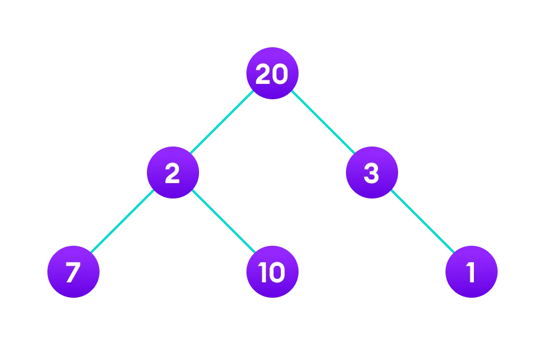

# Week 3 Review
## Java

### Factory Design Pattern
It is a creational design pattern which talks about the creation of an object. The factory design pattern says that define an interface ( A java interface or an abstract class) and let the subclasses decide which object to instantiate. The factory method in the interface lets a class defer the instantiation to one or more concrete subclasses. Since this design patterns talk about instantiation of an object and so it comes under the category of creational design pattern. If we notice the name Factory method, that means there is a method which is a factory, and in general factories are involved with creational stuff and here with this an object is being created. It is one of the best ways to create an object where object creation logic is hidden to the client.

<hr>
> Example
> **Problem Statement**: 
Consider we want to implement a notification service through email, SMS, and push notification. Let’s try to implement this with the help of factory method design pattern. First we will design a UML class diagram for this. 


1) Create the interface for sub-classes to implement (force each child to implement these behaviors)

Notification.java

```
// The interface
public interface Notification {
    void notifyUser();
}
```
2) Create the child classes that implement Notification (the interface just created)

SMSNotification.java:

```
// SMS Notification
public class SMSNotification implements Notification {
 
    @Override
    public void notifyUser()
    {
        // TODO Auto-generated method stub
        System.out.println("Sending an SMS notification");
    }
}
```
EmailNotification.java

```
// Email Notification
public class EmailNotification implements Notification {
 
    @Override
    public void notifyUser()
    {
        // TODO Auto-generated method stub
        System.out.println("Sending an e-mail notification");
    }
}
```
PushNotification.java

```
// Push Notification
public class PushNotification implements Notification {
 
    @Override
    public void notifyUser()
    {
        // TODO Auto-generated method stub
        System.out.println("Sending a push notification");
    }
}
```

NotificationFactory.java

```
// The factory class
public class NotificationFactory {
    public Notification createNotification(String channel)
    {
        if (channel == null || channel.isEmpty())
            return null;
        switch (channel) {
        case "SMS":
            return new SMSNotification();
        case "EMAIL":
            return new EmailNotification();
        case "PUSH":
            return new PushNotification();
        default:
            throw new IllegalArgumentException("Unknown channel "+channel);
        }
    }
}
```

NotificationService.java

```
public class NotificationService {
    public static void main(String[] args)
    {
        NotificationFactory notificationFactory = new NotificationFactory();
        Notification notification = notificationFactory.createNotification("SMS");
        notification.notifyUser();
    }
}
```

[Geeks-for-Geeks: Factory method design pattern in Java](https://www.geeksforgeeks.org/factory-method-design-pattern-in-java/)
### Singleton Design Pattern

```
public class Singleton{
	// variable to hold the singleton object
	// yup it is inside of the class
	// Mickey Mouse doesn't leave the paper but he is still alive and functioning.
	// And since Mickey Doesn't get get out of the paper no more can be made.
	
	private static Singleton firstInstance = null;
	
	// This constructor is only made to keep from making a new instance by accident.
	// The singleton should create itself. Like a dumb AI.
	// private means there is no outside access allowed.
	// The Class (very top) is public , but we do not want it instantiated form the outside.
	
	private Singleton(){}
	
	// This method will check to see if an instance has been created
	// and placed inside of the firstInstance property(field).
	// If not it will create a new instance(object) and place it in there.
	// If it has, it simply returns the one it created before.
	
	private static Singleton getInstance(){
		if(firstInstance == null){
			firstInstance = new Singleton();
		}
		return firstInstance;
	}
}
```

[Video explaining all of the above](https://www.youtube.com/watch?v=NZaXM67fxbs)

### Executor Service Design Pattern


### Runnable Pattern vs. Executor Service Pattern 


### Executor Interface


### Core Collections
The Collection framework represents a unified architecture for storing and manipulating a group of objects.


### Iterable Interface
The Iterable interface is the root interface for all the collection classes. The Collection interface extends the Iterable interface and therefore all the subclasses of Collection interface also implement the Iterable interface.

[Java Point: Collections in Java](https://www.javatpoint.com/collections-in-java)

### Iterators (Might need a redo)
In Java, an Iterator is one of the Java cursors. Java Iterator is an interface that is practiced in order to iterate over a collection of Java object components entirety one by one.

[Iterator in Java](https://www.javatpoint.com/java-iterator)

### Making custom data structures (??)

### For-each-loops
Another array traversing technique like the for-loop, while-loop, do-while loop. It is commonly used to iterate over an array or a Collections class (e.g. ArrayList). 

Syntax for for-each loop: 
```
for (type var : array) { 
    statements using var;
    } 
```
Is equivalent to: 
```
for (int i=0; i<arr.length; i++) { 
    type var = arr[i];
    statements using var;
}
```
[Geeks for Geeks - For_Each Loop] (https://www.geeksforgeeks.org/for-each-loop-in-java/)


### ArrayList Class
Java ArrayList class uses a dynamic array for storing the elements. It is like an array, but there is no size limit. We can add or remove elements anytime. So, it is much more flexible than the traditional array. It is found in the java.util package. It is like the Vector in C++.

The ArrayList in Java can have the duplicate elements also. It implements the List interface so we can use all the methods of the List interface here. The ArrayList maintains the insertion order internally.

It inherits the AbstractList class and implements List interface.

The important points about the Java ArrayList class are:
* Java ArrayList class can contain duplicate elements.
* Java ArrayList class maintains insertion order.
* Java ArrayList class is non synchronized.
* Java ArrayList allows random access because the array works on an index basis.
* In ArrayList, manipulation is a little bit slower than the LinkedList in Java because a lot of shifting needs to occur if any element is removed from the array list.
* We can not create an array list of the primitive types, such as int, float, char, etc. It is required to use the required wrapper class in such cases.

> For example:

```
ArrayList<int> al = ArrayList<int>(); // does not work  
ArrayList<Integer> al = new ArrayList<Integer>(); // works fine  
```

* Java ArrayList gets initialized by the size. The size is dynamic in the array list, which varies according to the elements getting added or removed from the list.

[Java Point: Java ArrayList](https://www.javatpoint.com/java-arraylist)

### LinkedList Class
Java LinkedList class uses a doubly linked list to store the elements. It provides a linked-list data structure. It inherits the AbstractList class and implements List and Deque interfaces.

The important points about Java LinkedList are:

* Java LinkedList class can contain duplicate elements.
* Java LinkedList class maintains insertion order.
* Java LinkedList class is non synchronized.
* In Java LinkedList class, manipulation is fast because no shifting needs to occur.
* Java LinkedList class can be used as a list, stack or queue.

[Java Point: Java Linked List Class](https://www.javatpoint.com/java-linkedlist)

### ArrayDeque Class (DE Double Ended thnx Levi)
The ArrayDeque class provides the facility of using deque and resizable-array. It inherits AbstractCollection class and implements the Deque interface.

The important points about ArrayDeque class are:

* Unlike Queue, we can add or remove elements from both sides.
* Null elements are not allowed in the ArrayDeque.
* ArrayDeque is not thread safe, in the absence of external synchronization.
* ArrayDeque has no capacity restrictions.
* ArrayDeque is faster than LinkedList and Stack.

[JavaPoint: Java Deque Interface -> ArrayDeque Class](https://www.javatpoint.com/java-deque-arraydeque)

### TreeSet Class
Java TreeSet class implements the Set interface that uses a tree for storage. It inherits AbstractSet class and implements the NavigableSet interface. The objects of the TreeSet class are stored in ascending order.

The important points about Java TreeSet class are:

* Java TreeSet class contains unique elements only like HashSet.
* Java TreeSet class access and retrieval times are quite fast.
* Java TreeSet class doesn't allow null element.
* Java TreeSet class is non synchronized.
* Java TreeSet class maintains ascending order.

[Java Point: Java TreeSet Class](https://www.javatpoint.com/java-treeset)

### Map Interface
A map contains values on the basis of key, i.e. key and value pair. Each key and value pair is known as an entry. A Map contains unique keys.

A Map is useful if you have to search, update or delete elements on the basis of a key.

[Java Point: Java Map Interface](https://www.javatpoint.com/java-map)

### HashMap Class
Java **HashMap** class implements the Map interface which allows us to store key and value pair, where keys should be unique. If you try to insert the duplicate key, it will replace the element of the corresponding key. It is easy to perform operations using the key index like updating, deletion, etc. HashMap class is found in the java.util package.

HashMap in Java is like the legacy Hash table class, but it is not synchronized. It allows us to store the null elements as well, but there should be only one null key. Since Java 5, it is denoted as HashMap<K,V>, where K stands for key and V for value. It inherits the AbstractMap class and implements the Map interface.

Points to remember:

* Java HashMap contains values based on the key.
* Java HashMap contains only unique keys.
* Java HashMap may have one null key and multiple null values.
* Java HashMap is non synchronized.
Java HashMap maintains no order.
* The initial default capacity of Java HashMap class is 16 with a load factor of 0.75.

### TreeMap Class
Java TreeMap class is a red-black tree based implementation. It provides an efficient means of storing key-value pairs in sorted order.

The important points about Java TreeMap class are:

* Java TreeMap contains values based on the key. It implements the NavigableMap interface and extends AbstractMap class.
* Java TreeMap contains only unique elements.
* Java TreeMap cannot have a null key but can have multiple null values.
* Java TreeMap is non synchronized.
* Java TreeMap maintains ascending order.

### Creating a Custom Logger (N/A This would have just been a demo)

### Functional Interfaces
Class Demo:

```
package com.revature.functional_interfaces;

import java.util.function.Function;

public class FunctionalInterfaceDemo{

	@FunctionalInterface
	interface Playable {
		public void doSomePlay(String word);
	}

	public static void main(String[] args) {
		// using a functional interface to solve a math problem
		Function<Integer, Integer> square = n -> n * n;
		
		//use of the apply method
		System.out.println(square.apply(7)); //should print 49
		
		/* This is the same as doing this:
		 * @FunctionalInterface
			interface square{
				public int apply(int x);
			}
		 * */

		//use of our custom functional interfaces and their methods
		Playable play = (String word) -> System.out.println("Hello " + word);
		
		play.doSomePlay("Chucky");
		
		Workable w = () -> System.out.println("I am working on my project.");
		w.doFirstWork();
	}

}
```
Additional Reading material: [Functional Interfaces in Java 8](https://www.baeldung.com/java-8-functional-interfaces)

### Lambda Expressions
Lambda expressions basically express instances of functional interfaces (An interface with single abstract method is called functional interface. 

> Example

```
// Java program to demonstrate lambda expressions
// to implement a user defined functional interface.
  
// A sample functional interface (An interface with
// single abstract method
interface FuncInterface
{
    // An abstract function
    void abstractFun(int x);
  
    // A non-abstract (or default) function
    default void normalFun()
    {
       System.out.println("Hello");
    }
}
  
class Test
{
    public static void main(String args[])
    {
        // lambda expression to implement above
        // functional interface. This interface
        // by default implements abstractFun()
        FuncInterface fobj = (int x)->System.out.println(2*x);
  
        // This calls above lambda expression and prints 10.
        fobj.abstractFun(5);
    }
}
```

[Geeks-for-Geeks: Lambda Expressions in Java 8](https://www.geeksforgeeks.org/lambda-expressions-java-8/)

### Method References
Method references are a special type of lambda expressions. They're often used to create simple lambda expressions by referencing existing methods.

There are four kinds of method references:

* Static methods
* Instance methods of particular objects
* Instance methods of an arbitrary object of a particular type
* Constructor

**Reference to a Static Method**
Capitalizing and printing a list of Strings:

```
List<String> messages = Arrays.asList("hello", "baeldung", "readers!");
```
We can achieve this by leveraging a simple lambda expression calling the StringUtils.capitalize() method directly:

```
messages.forEach(word -> StringUtils.capitalize(word));
```
Or, we can use a method reference to simply refer to the capitalize static method:

```
messages.forEach(StringUtils::capitalize);
```

Notice that method references always utilize the :: operator.

There is a lot more that can be read ... [Baeldung: Method References in Java](https://www.baeldung.com/java-method-references)

### Comparable interfaces
Java Comparable interface is used to order the objects of the user-defined class. This interface is found in java.lang package and contains only one method named compareTo(Object). It provides a single sorting sequence only, i.e., you can sort the elements on the basis of single data member only. For example, it may be rollno, name, age or anything else.

**compareTo(Object obj) method**

**public int compareTo(Object obj)**: It is used to compare the current object with the specified object. It returns

* positive integer, if the current object is greater than the specified object.
* negative integer, if the current object is less than the specified object.
* zero, if the current object is equal to the specified object.

<hr>
We can sort the elements of:

1. String objects
1. Wrapper class objects
1. User-defined class objects


### Comparator Interface
A comparator interface is used to order the objects of user-defined classes. A comparator object is capable of comparing two objects of the same class. Following function compare obj1 with obj2.

```
public int compare(Object obj1, Object obj2):
```

> Example

```
// Java Program to Demonstrate Working of
// Comparator Interface
 
// Importing required classes
import java.io.*;
import java.lang.*;
import java.util.*;
 
// Class 1
// A class to represent a Student
class Student {
 
    // Attributes of a student
    int rollno;
    String name, address;
 
    // Constructor
    public Student(int rollno, String name, String address)
    {
 
        // This keyword refers to current instance itself
        this.rollno = rollno;
        this.name = name;
        this.address = address;
    }
 
    // Method of Student class
    // To print student details in main()
    public String toString()
    {
 
        // Returning attributes of Student
        return this.rollno + " " + this.name + " "
            + this.address;
    }
}
 
// Class 2
// Helper class implementing Comparator interface
class Sortbyroll implements Comparator<Student> {
 
    // Method
    // Sorting in ascending order of roll number
    public int compare(Student a, Student b)
    {
 
        return a.rollno - b.rollno;
    }
}
 
// Class 3
// Helper class implementing Comparator interface
class Sortbyname implements Comparator<Student> {
 
    // Method
    // Sorting in ascending order of name
    public int compare(Student a, Student b)
    {
 
        return a.name.compareTo(b.name);
    }
}
 
// Class 4
// Main class
class GFG {
 
    // Main driver method
    public static void main(String[] args)
    {
 
        // Creating an empty ArrayList of Student type
        ArrayList<Student> ar = new ArrayList<Student>();
 
        // Adding entries in above List
        // using add() method
        ar.add(new Student(111, "Mayank", "london"));
        ar.add(new Student(131, "Anshul", "nyc"));
        ar.add(new Student(121, "Solanki", "jaipur"));
        ar.add(new Student(101, "Aggarwal", "Hongkong"));
 
        // Display message on console for better readability
        System.out.println("Unsorted");
 
        // Iterating over entries to print them
        for (int i = 0; i < ar.size(); i++)
            System.out.println(ar.get(i));
 
        // Sorting student entries by roll number
        Collections.sort(ar, new Sortbyroll());
 
        // Display message on console for better readability
        System.out.println("\nSorted by rollno");
 
        // Again iterating over entries to print them
        for (int i = 0; i < ar.size(); i++)
            System.out.println(ar.get(i));
 
        // Sorting student entries by name
        Collections.sort(ar, new Sortbyname());
 
        // Display message on console for better readability
        System.out.println("\nSorted by name");
 
        // // Again iterating over entries to print them
        for (int i = 0; i < ar.size(); i++)
            System.out.println(ar.get(i));
    }
}
```

### Streams API
This is more of a how to and both resources show the how-to.
The class demo may be a little easier to understand, while the Baeldung is more comprehensive.

[Streams API Demo](https://github.com/220418-UTA-SH-Java-Enterprise/training-repo/tree/main/demos/3%20-%20Java%20SE%20API/HelloStreamsAPI/src/main/java/com/streams)

[Baeldung: The Java 8 Stream API](https://www.baeldung.com/java-8-streams)

### Streaming Collections
A Collection is an in-memory data structure, which holds all the values that the data structure currently has. Every element in the Collection has to be computed before we add it to the Collection. Operations such as searching, sorting, insertion, manipulation, and deletion can be performed on a Collection. It provides many interfaces like (Set, List, Queue, Deque) and Classes like (ArrayList, Vector, LinkedList, PriorityQueue, HashSet).

On the other hand, IStream is an API that is introduced in Java 8 which is used to process collections of objects. A stream is a sequence of objects that supports various methods which can be pipelined to produce the desired result. The Stream API is used to process collections of objects. A stream is a sequence of objects that supports various methods that can be pipelined to produce the desired result.

> Example (the folling two snips of code result in the same thing).

Colections only

```
// Java Program to Illustrate Collection

// Importing required classes
import java.io.*;
import java.util.*;

// Main class
class GFG {

	// Main driver method
	public static void main(String[] args)
	{
		// Creating an instance of list
		List<String> CompanyList = new ArrayList<>();

		// Adding elements using add() method
		CompanyList.add("Google");
		CompanyList.add("Apple");
		CompanyList.add("Microsoft");

		// Now creating a comparator
		Comparator<String> com
			= (String o1, String o2) -> o1.compareTo(o2);

		// Sorting the list
		Collections.sort(CompanyList, com);

		// Iterating using for each loop
		for (String name : CompanyList) {

			// Printing the elements
			System.out.println(name);
		}
	}
}
```

Collections piped through a stream

```
// Java Program to Demonstrate streams

// Importing required classes
import java.io.*;
import java.util.*;

// Main class
class GFG {

	// Main driver method
	public static void main(String[] args)
	{
		// Creating an empty Arraylist
		List<String> CompanyList = new ArrayList<>();

		// Adding elements to above ArrayList
		CompanyList.add("Google");
		CompanyList.add("Apple");
		CompanyList.add("Microsoft");

		// Sorting the list
		// using sorted() method and
		// printing using for-each loop
		CompanyList.stream().sorted().forEach(
			System.out::println);
	}
}
```

The difference? In this case almost 10 lines of code.

[Geeks-for-Geeks: DIfference Between Streams and Collections in Java](https://www.geeksforgeeks.org/difference-between-streams-and-collections-in-java/)

### Terminal Stream Operations
A terminal stream operation is an operation that starts the internal iteration of the elements, calls all the listeners, and returns a result.

[Jenkov Tech & Media Labs: Java Stream API -> Terminal and Non-Terminal Operations](https://jenkov.com/tutorials/java-functional-programming/streams.html)

### Intermediate Stream Operations
Intermediate operators do not execute until a terminal operation is invoked, i.e. they are not executed until a result of processing is actually needed.

Important and most frequently used: 

1. filter(predicate) Method 
2. sorted() Method 
3. distinct() Method 
4. map() Method

[Geeks-for-Geeks: Intermediate Methods of Stream in Java](https://www.geeksforgeeks.org/intermediate-methods-of-stream-in-java/)

### Stream Reduction

### Optional Class
[Geeks-for-Geeks](https://www.geeksforgeeks.org/java-8-optional-class/)
### Stream Collection Operations

Reduction stream operations allow us to produce one single result from a sequence of elements, by repeatedly applying a combining operation to the elements in the sequence.

> Tutorial

Using Stream.reduce()

To better understand the functionality of the identity, accumulator and combiner elements, let's look at some basic examples:

```
List<Integer> numbers = Arrays.asList(1, 2, 3, 4, 5, 6);
int result = numbers
  .stream()
  .reduce(0, (subtotal, element) -> subtotal + element);
assertThat(result).isEqualTo(21);
```

In this case, the Integer value 0 is the identity. It stores the initial value of the reduction operation and also the default result when the stream of Integer values is empty.

Likewise, the lambda expression:

```
subtotal, element -> subtotal + element
```

is the accumulator since it takes the partial sum of Integer values and the next element in the stream.

To make the code even more concise, we can use a method reference instead of a lambda expression:

```
int result = numbers.stream().reduce(0, Integer::sum);
assertThat(result).isEqualTo(21);
```
Of course, we can use a reduce() operation on streams holding other types of elements.

There is more at the link:
[Baeldung: Guide to Stream.reduce()]()

### Composing Comparators

Another Demo required response...
[Baeldung: Comparator and Comparable in Java](https://www.baeldung.com/java-comparator-comparable)
[Training repo](https://github.com/220418-UTA-SH-Java-Enterprise/training-repo/tree/main/demos/3%20-%20Java%20SE%20API/HelloComparableComparator)

### java.util.function Package

### Supplier Interfaces

### Consumer interfaces

### Predicate Interfaces

### Function Interfaces

### Primitive Specializations of Functional Interfaces

### Package java.time 
The main API for dates, times, instants, and durations.

Classes defined here represent the principle date-time concepts, including instants, durations, dates, times, time-zones and periods. 
    <ul> - All the classes are immutable and thread-safe. </ul>


Some classes...
- **LocalDate**: A date without a time, or any reference to an offset or timezone (ex: 2007-12-03)
- **LocalTime**: A time without a date, or any reference to an offset or timezone (ex: 10:15:30)
- **LocalDateTime**: Combines date and time, but still without any offset or timezone (ex:  2007 - 12 - 03T10: 15:30)

[Package java.time](https://docs.oracle.com/javase/8/docs/api/java/time/package-summary.html#package.description)


### Parsing & Formatting Dates 


### Multithreading 


### Creating and Executing Threads 


### Identifying a Lock Object 


### Suspending a thread with .wait()


### Stopping a thread using .interrupt()


### Reflection API 
The Reflections API is used to examine or modify the behavior of classes/methods/interfaes at runtime. It comes from the java.lang.reflect package. 


Reflection gives us info about the class to which an object belongs and also the methods of that class that can be executed by using the object. Through reflection, we can invoke methods at runtime irrespective of the access specifier used with them.

**Class** - the universal type for the meta information that describes objects within the Java system. Class loaders in the Java system return objects of type Class. 

**Constructors**

**Methods**

[Geek for Geeks: Reflections API](https://www.geeksforgeeks.org/reflection-in-java/)


### Retrieving Class Objects (Relections)
**Class** - the universal type for the meta information that describes objects within the Java system. Class loaders in the Java system return objects of type Class. 

### Discovering Class Members (Reflections)


### Examining Class modifiers and types (Reflections)


### Obtaining field types 


### Retrieving and parsing field modifiers 


### Getting and setting field values 


### Obtaining names of method parameters 


### Retrieving and parsing method modifiers 


### Invoking methods (Reflections)
We can invoke a method through reflection if we know its name and parameter types. We use two methods for this purpose as described below before moving ahead as follows:
1. `getDeclaredMethod()` creates an object of the method to be invoked 
```
    Class.getDeclaredMethod(name, parametertype)
```
    name = Name of a method whose object is to be created
    parametertype = An array of Class objects
2. `invoke()` invokes a method of the class at runtime
```
    Method.invoke(Object, parameter)
```
[Geek for Geeks: Reflections API](https://www.geeksforgeeks.org/reflection-in-java/)


### Finding constructors 


### Retrieving and parsing constructor modifiers 


### Creating new class instances 


### Identifying array types 


### Examining enums 
- Enums restrict a variable to have one of only a few predefined values. The values in this enumerated list are called **enums**.
- Possible to reduce the number of bugs in your code by using enums. 
- Enums can be declared as their own or inside a class. Methods, variables, constructors can be defined inside enums as well.
- Ex: Consider an application for a fresh juice shop
→ can restrict the glass size to small, medium and large → makes it so that it won’t allow anyone to order any size other than small, medium, or large 


Code example: 
```
class FreshJuice {

   enum FreshJuiceSize{ SMALL, MEDIUM, LARGE }
   FreshJuiceSize size;
}

public class FreshJuiceTest {

   public static void main(String args[]){
      FreshJuice juice = new FreshJuice();
      juice.size = FreshJuice.FreshJuiceSize.MEDIUM ;
      System.out.println("Size: " + juice.size);
   }
}
```
Output: 
```
Size: MEDIUM
```


### Creating JDK Proxy Objects (?)

### DIY Testing Framework (?) 


<hr>
## Data Structures & Algorithms

### Greedy Algorithms
A greedy algorithm is an approach for solving a problem by selecting the best option available at the moment. It doesn't worry whether the current best result will bring the overall optimal result.

1. **Greedy Choice Property**
If an optimal solution to the problem can be found by choosing the best choice at each step without reconsidering the previous steps once chosen, the problem can be solved using a greedy approach. This property is called greedy choice property.

2. **Optimal Substructure**
If the optimal overall solution to the problem corresponds to the optimal solution to its subproblems, then the problem can be solved using a greedy approach. This property is called optimal substructure.
<hr>

**Advantages of Greedy Approach**

* The algorithm is easier to describe.
* This algorithm can perform better than other algorithms (but, not in all cases).

**Drawback of Greedy Approach**

* As mentioned earlier, the greedy algorithm doesn't always produce the optimal solution. This is the major disadvantage of the algorithm

<hr>

> Example, suppose we want to find the longest path in the graph below from root to leaf. Let's use the greedy algorithm here.



**Greedy Approach**

1. Let's start with the root node 20. The weight of the right child is 3 and the weight of the left child is 2.

2. Our problem is to find the largest path. And, the optimal solution at the moment is 3. So, the greedy algorithm will choose 3.

3. Finally the weight of an only child of 3 is 1. This gives us our final result 20 + 3 + 1 = 24.

> However, it is not the optimal solution. There is another path that carries more weight (20 + 2 + 10 = 32)

### Hash Functions
Hash Function can be defined as an algorithm or a function that is used to map or convert data of bigger size or length to a fixed or small index or hash value. In other words, a hash function can be defined as an algorithm that will be used to convert the data of higher length or size to data that is within a fixed range or size.

### Hash Set
Java HashSet class is used to create a collection that uses a hash table for storage. It inherits the AbstractSet class and implements Set interface.

The important points about Java HashSet class are:

* HashSet stores the elements by using a mechanism called hashing.
* HashSet contains unique elements only.
* HashSet allows null value.
* HashSet class is non synchronized.
* HashSet doesn't maintain the insertion order. Here, elements are inserted on the basis of their hash-code.
* HashSet is the best approach for search operations.
* The initial default capacity of HashSet is 16, and the load factor is 0.75.

[Java Point: Java Hash set](https://www.javatpoint.com/java-hashset)

### Sets
A set is defined as a collection of distinct objects of the same type or class of objects. The purposes of a set are called elements or members of the set. An object can be numbers, alphabets, names, etc.

> Examples of sets are:
A set of rivers of India.
A set of vowels.

We broadly denote a set by the capital letter A, B, C, etc. while the fundamentals of the set by small letter a, b, x, y, etc.

If A is a set, and a is one of the elements of A, then we denote it as a ∈ A. Here the symbol ∈ means -"Element of."

_**Sets Representation:**_

Sets are represented in two forms:-

* Roster or tabular form: In this form of representation we list all the elements of the set within braces { } and separate them by commas.

> Example: If A= set of all odd numbers less than 10 then in the roster from it can be expressed as A={ 1,3,5,7,9}.

* Set Builder form: In this form of representation we list the properties fulfilled by all the elements of the set. We note as {x: x satisfies properties P}. and read as 'the set of those entire x such that each x has properties P.'

> Example: If B= {2, 4, 8, 16, 32}, then the set builder representation will be: B={x: x=2n, where n ∈ N and 1≤ n ≥5}

[Java Point: Introduction of Sets](https://www.javatpoint.com/sets-introduction)

### Queues
Queue is the data structure that is similar to the queue in the real world. A queue is a data structure in which whatever comes first will go out first, and it follows the FIFO (First-In-First-Out) policy. Queue can also be defined as the list or collection in which the insertion is done from one end known as the rear end or the tail of the queue, whereas the deletion is done from another end known as the front end or the head of the queue.

### Dequeues
The deque stands for Double Ended Queue. Deque is a linear data structure where the insertion and deletion operations are performed from both ends. We can say that deque is a generalized version of the queue.

Though the insertion and deletion in a deque can be performed on both ends, it does not follow the FIFO rule.

**Types of deque**

There are two types of deque -

* Input restricted queue
* Output restricted queue

**Input restricted Queue**

In input restricted queue, insertion operation can be performed at only one end, while deletion can be performed from both ends.

**Output restricted Queue**

In output restricted queue, deletion operation can be performed at only one end, while insertion can be performed from both ends.

**Operations performed on deque**

There are the following operations that can be applied on a deque -

* Insertion at front
* Insertion at rear
* Deletion at front
* Deletion at rear

We can also perform peek operations in the deque along with the operations listed above. Through peek operation, we can get the deque's front and rear elements of the deque. So, in addition to the above operations, following operations are also supported in deque -

* Get the front item from the deque
* Get the rear item from the deque
* Check whether the deque is full or not
* Checks whether the deque is empty or not

### Trees
A tree is also one of the data structures that represent hierarchical data.

**Let's understand some key points of the Tree data structure.**

* A tree data structure is defined as a collection of objects or entities known as nodes that are linked together to represent or simulate hierarchy.
* A tree data structure is a non-linear data structure because it does not store in a sequential manner. It is a hierarchical structure as elements in a Tree are arranged in multiple levels.
* In the Tree data structure, the topmost node is known as a root node. Each node contains some data, and data can be of any type. In the above tree structure, the node contains the name of the employee, so the type of data would be a string.
* Each node contains some data and the link or reference of other nodes that can be called children.

**Some basic terms used in Tree data structure**

* **Root**: The root node is the topmost node in the tree hierarchy. In other words, the root node is the one that doesn't have any parent. In the above structure, node numbered 1 is the root node of the tree. If a node is directly linked to some other node, it would be called a parent-child relationship.
* **Child node**: If the node is a descendant of any node, then the node is known as a child node.
* **Parent**: If the node contains any sub-node, then that node is said to be the parent of that sub-node.
* **Sibling**: The nodes that have the same parent are known as siblings.
* **Leaf Node**:- The node of the tree, which doesn't have any child node, is called a leaf node. A leaf node is the bottom-most node of the tree. There can be any number of leaf nodes present in a general tree. Leaf nodes can also be called external nodes.
* **Internal nodes**: A node has at least one child node known as an internal
* **Ancestor node**:- An ancestor of a node is any predecessor node on a path from the root to that node. The root node doesn't have any ancestors. In the tree shown in the above image, nodes 1, 2, and 5 are the ancestors of node 10.
* **Descendant**: The immediate successor of the given node is known as a descendant of a node. In the above figure, 10 is the descendant of node 5.

### Heaps (??)
A heap is a complete binary tree, and the binary tree is a tree in which the node can have utmost two children. Before knowing more about the heap data structure, we should know about the complete binary tree.

[Java Point: Heap Data Structure](https://www.javatpoint.com/heap-data-structure)

### Maps (??)

### Depth-first Searching
Depth-first search is an algorithm for traversing or searching tree or graph data structures. The algorithm starts at the root node (selecting some arbitrary node as the root node in the case of a graph) and explores as far as possible along each branch before backtracking. So the basic idea is to start from the root or any arbitrary node and mark the node and move to the adjacent unmarked node and continue this loop until there is no unmarked adjacent node. Then backtrack and check for other unmarked nodes and traverse them. Finally, print the nodes in the path.

[Depth First Search or DFS for a Graph](https://www.geeksforgeeks.org/depth-first-search-or-dfs-for-a-graph/)

### Breadth-First Searching
starts at the tree root and explores all nodes at the present depth prior to moving on to the nodes at the next depth level. Extra memory, usually a queue, is needed to keep track of the child nodes that were encountered but not yet explored.

[Breadth First Search or BFS for a Graph](https://www.geeksforgeeks.org/breadth-first-search-or-bfs-for-a-graph/?ref=gcse)
[Breadth-First Search](https://en.wikipedia.org/wiki/Breadth-first_search)


<hr>
## Unix/Linux
### Using Curl to Hit Web Endpoints

This is really just a list of commands. They need to be edited for YOURSPECIFIC APP, but otherwise fairly simple


```
curl -v http://www.example.com/
```

Some Vocab:
**GET** - HTTP Protocol to send a get request to a server. The request data is appended to the URL
**POST** - HTTP Protocol to send a post requiest. This is how forms normally should be sent. Unlike the GET request the informaiton will not be appended to the URL 
**PUT** - mainly used for updating existing requests, but will also create a new one if one does not exist.
**DELETE** - I think you can guess this one =)

[Test a REST API with curl](https://www.baeldung.com/curl-rest)


### Relative and Absolute Paths 

<hr>

## OOP
### Object Relational Mapping

<hr>

## Multithreading 
### Concurrency 


### Parallelism 

### Asynchrony 

### Synchronized Resources 

### Locks and Keys 

### Thread Pooling 


<hr> 

## Tooling
### Postman

<hr>

## Testing
### Coverage Reports 
### JaCoCo
### API Testing Tools 
### Leveraging an in-memory DB for testing (??)
