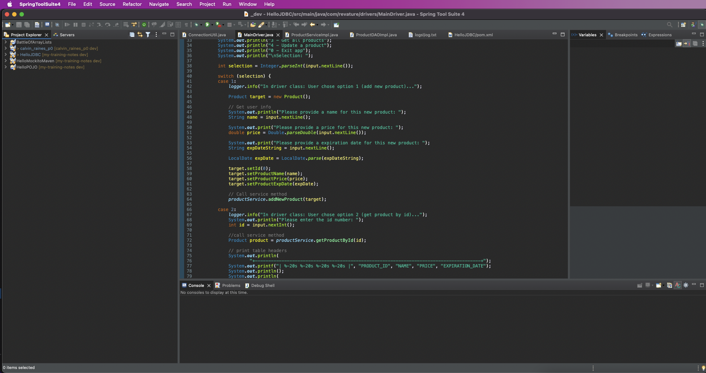
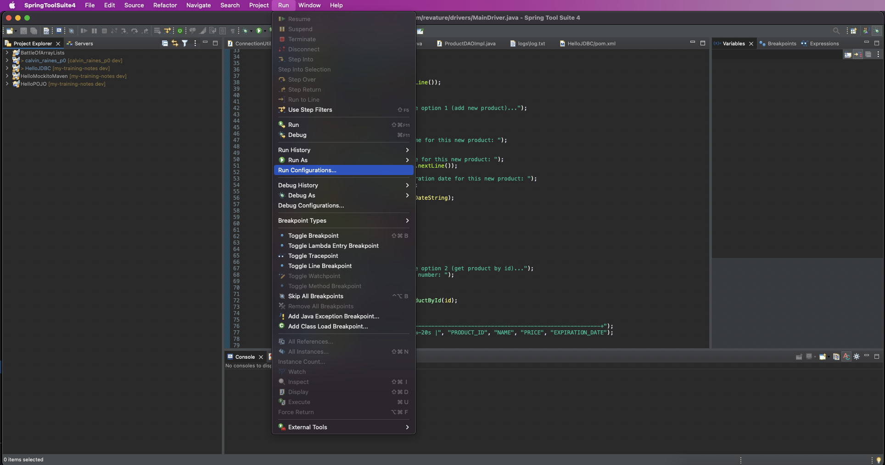
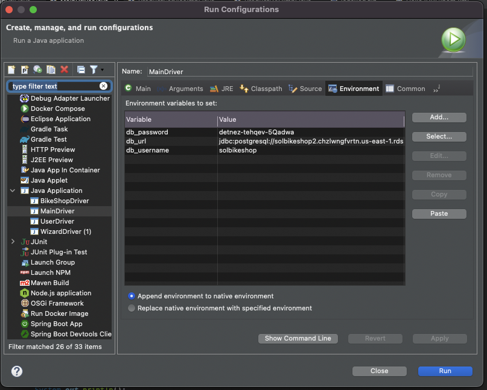
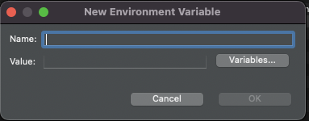
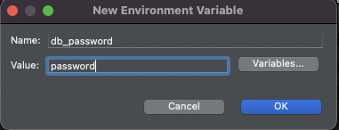
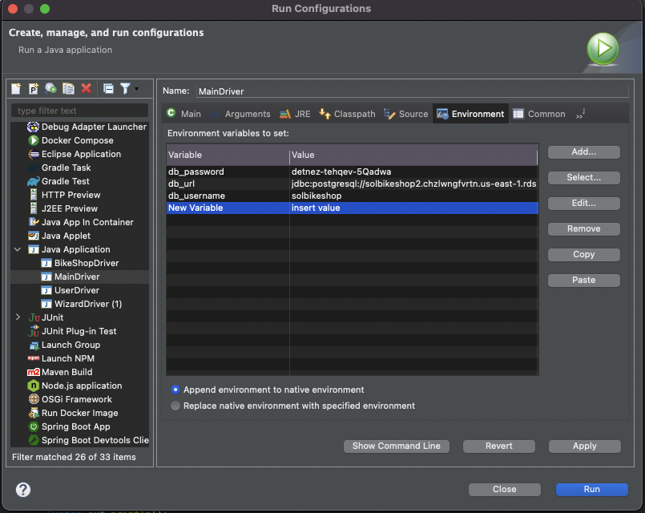

# Setting environment Variables without messing with the system files

1. Open Spring Tools

2. From the menu Slelect Run => Run COnfigurations...

3. Select the "Environment" tab

4. Repeat the follwing 1-4 for each variable before going on to step 5.

	1. Click add

	
	2. Type in the variable name (db_username, db_password, OR db_url)
	3. Enter the value of the variable (in the value field)
	
	
	4. click "OK"
5. Click Apply
6. Click Close

